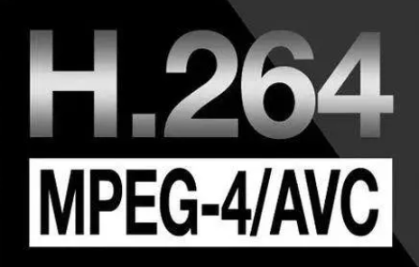

# h265web.js

<a href="README.MD">中文</a> | <a href="README_EN.MD">English</a>

<strong>
市场上能找到的支持的能力最多的HEVC/H.265网页播放器.
 
流媒体服务推荐用 <a href="https://github.com/ZLMediaKit/ZLMediaKit">ZLMediaKit(https://github.com/ZLMediaKit/ZLMediaKit) - 更好用的流媒体服务</a>
</strong>
 
一个可支持HEVC/H.265编码播放360P、480P、540P、720P、1080P的HEVC播放器 
 

### O、接入案例（部分）

<strong>

|  |  |  |  |  |  |  |  |
| ---- | ---- | ---- | ---- | ---- | ---- | ---- | ---- |
| 拼多多 | 快手 | 爱奇艺 | 百度集团 | 百度智能云 | 北京数通魔方 | 杭州诚智天扬 | 南京一乙 |
|   |   |   |   |   |   |   |   |
|  |  |  |   |   |   |   |   |
| 山东呢尔德 | 上海联通 | 西安思华 |   |   |   |   |   |
  </strong>
  

<h3>能力矩阵</h3>

<strong>

| Feature | Feature | Feature | Feature |
| ---- | ---- | ---- | ---- |
|  |  |  |  | 
| HLS(LIVE)| M3u8(VOD) | MP4(VOD) | FLV(VOD) | 
|   |   |   |   |
|  |  |  |  |
| HTTP-FLV(LIVE) | HTTP-TS(LIVE) | WS-FLV(LIVE) | WS-TS(LIVE) |
|   |   |   |   |
|  |  |  | |
| MPEG-TS(VOD) | MPEG-PS(VOD) | AV1(Chrome) | MOV(H.265) |
|   |   |   |   |
|  |  |   |  |
| HTTP-HEVC | WS-HEVC | MKV(HEVC) | AAC(MAIN/LC) |
|   |   |   |   |
|  |  |  |  |
| Multi-Thread (only: https+nginx conf) | G711A(HTTP-FLV) | HEVC/H.265 | AVC/H.264 |
|   |   |   |   |
|  |  | - | - |
| Single-Thread | MediaInfo | - | - |

</strong>

#### 在线DEMO <a href="https://www.zzsin.com/h265webjs.html"> h265webjs.html (请以Github最新为准,在线Demo已长时间未更新)
</a>

#### 入门调试Demo <a href="index-debug.html">index-debug.html</a>

#### 当前能力 ####

* 协议

| 协议  | 模式 | 是否支持 | 说明 |
| ---- | ---- |  ----  | ---- |
| mp4 | 点播 |  是  | ---- |
| mov | 点播 |  是  | HEVC/H.265 |
| mkv | 点播 |  是  | HEVC/H.265 |
| av1 | 点播 |  是  | Chrome |
| mpeg-ts | 点播 |  是  | ---- |
| mpeg-ps | 点播 |  是  | ---- |
| m3u8 | 点播 |  是  | ---- |
| hls | 直播 |  是  | ---- |
| flv | 点播 |  是  | --- |
| http-flv | 直播 |  是  | CodecID=12 |
| http-ts | 直播 |  是  | ---- |
| http-hevc | 直播 |  是  | ---- |
| http-hevc | 点播 |  是  | ---- |
| websocket-hevc | 直播 |  是  | ---- |
| websocket-flv | 直播 |  是  | ---- |
| websocket-ts | 直播 |  是  | ---- |
| HEVC/H.265 | 点播 |  是  | ---- |
| HEVC/H.265 | 直播 |  是  | ---- |
| AVC/H.264 | 点播 |  是  | ---- |
| AVC/H.264 | 直播 |  是  | ---- |

* 编码

| 编码 | 是否支持 | 说明 |
| ---- |  ----  | ---- |
| AVC/H.264 |  是  | ---- |
| HEVC/H.265 |  是  | ---- |
| AAC |  是  | ---- |
| G711A |  是  | HTTP-FLV |
| AV1 |  是  | Chrome |

* 能力

| 能力 | 是否支持 | 其他 |
| ---- | ---- |  ----  |
| 直播 | 是 |  ----  |
| 点播 | 是 |  ----  |
| Seek跳转 | 是 | ---- |
| 精准Seek | 是 |  ----  |
| 封面图 | 是 |  ----  |
| 边下边播 | 是 |  ----  |
| 音量调节 | 是 |  ----  |
| 播放 | 是 |  ----  |
| 暂停 | 是 |  ----  |
| 重新播放 | 是 |  ----  |
| 暂停截图 | 是 |  ----  |
| 1080p播放 | 是 |  ----  |
| 720p播放 | 是 |  ----  |
| 多路播放 | 是 |  ----  |
| 去音频播放 | 是 |  ----  |
| 缓冲进度 | 是 |  ----  |
| 开启全屏播放 | 是 |  ----  |
| 退出全屏播放 | 是 |  ----  |
| 逐帧播放 | 是 |  ----  |
| 截图 | 是 | ----  |
| 自动播放 | 是 | HTTP-FLV 265+264 HTTP-TS 265+264 HLS 264  |
| 设置缓存长度 | 是 | MP4 265 |
| 多线程解码 | 是 | (需要HTTPS+配置NGINX支持) |
| 单线程解码 | 是 | 兼容性强 |
| 获取 MediaInfo | 是 | ---- |
| 获取 Codec编码 | 是 | 视频&音频 |
| 获取 Media Duration 时长 | 是 | 视频&音频|
| 获取 视频尺寸 | 是 | ---- |
| 获取 视频帧率 | 是 | ---- |
| 获取 音频采样率 | 是 | ---- |

 

# 全部文档 #

* <a href="https://github.com/numberwolf/h265web.js/wiki">WIKI首页</a>

### 一、SDK使用文档

* [【LICENSE】CYL—Free 1.0](https://github.com/numberwolf/h265web.js/wiki/%E3%80%90LICENSE%E3%80%91CYL%E2%80%94Free-1.0)

* [【说明】播放器能力介绍](https://github.com/numberwolf/h265web.js/wiki/%E3%80%90%E8%AF%B4%E6%98%8E%E3%80%91%E6%92%AD%E6%94%BE%E5%99%A8%E8%83%BD%E5%8A%9B%E4%BB%8B%E7%BB%8D)

* [【说明】创建播放器](https://github.com/numberwolf/h265web.js/wiki/%E3%80%90%E8%AF%B4%E6%98%8E%E3%80%91%E5%88%9B%E5%BB%BA%E6%92%AD%E6%94%BE%E5%99%A8)

* [【说明】API使用](https://github.com/numberwolf/h265web.js/wiki/%E3%80%90%E8%AF%B4%E6%98%8E%E3%80%91API%E4%BD%BF%E7%94%A8)

* [【说明】Event事件 回调](https://github.com/numberwolf/h265web.js/wiki/%E3%80%90%E8%AF%B4%E6%98%8E%E3%80%91Event%E4%BA%8B%E4%BB%B6-%E5%9B%9E%E8%B0%83)

### 二、问题QA指引

* [【QA解答】初始化失败系列](https://github.com/numberwolf/h265web.js/wiki/%E3%80%90QA%E8%A7%A3%E7%AD%94%E3%80%91%E5%88%9D%E5%A7%8B%E5%8C%96%E5%A4%B1%E8%B4%A5%E7%B3%BB%E5%88%97)

* [【QA解答】开始播放后遇到的问题系列](https://github.com/numberwolf/h265web.js/wiki/%E3%80%90QA%E8%A7%A3%E7%AD%94%E3%80%91%E5%BC%80%E5%A7%8B%E6%92%AD%E6%94%BE%E5%90%8E%E9%81%87%E5%88%B0%E7%9A%84%E9%97%AE%E9%A2%98%E7%B3%BB%E5%88%97)

* [【视频转码指南】如何用FFmpeg编码合格的 直播 点播 视频](https://github.com/numberwolf/h265web.js/wiki/%E3%80%90%E8%A7%86%E9%A2%91%E8%BD%AC%E7%A0%81%E6%8C%87%E5%8D%97%E3%80%91%E5%A6%82%E4%BD%95%E7%94%A8FFmpeg%E7%BC%96%E7%A0%81%E5%90%88%E6%A0%BC%E7%9A%84-%E7%9B%B4%E6%92%AD-%E7%82%B9%E6%92%AD-%E8%A7%86%E9%A2%91)

### 三、合作项目

* [好用的流媒体服务 ZLMediaKit](https://github.com/ZLMediaKit/ZLMediaKit)

* [FFmpeg支持265的HTTP-FLV直播](https://github.com/numberwolf/FFmpeg-QuQi-H265-FLV-RTMP)

* [Web端265解码器](https://github.com/numberwolf/h265web.js-wasm-decoder)

* [YuvEye 国内第一款图像质量、YUV分析工具](https://www.zzsin.com/YUVEye.html)

### 四、关于

* [【技术社区】提问 交流 — 联系我 技术支持群](https://github.com/numberwolf/h265web.js/wiki/%E3%80%90%E6%8A%80%E6%9C%AF%E7%A4%BE%E5%8C%BA%E3%80%91%E6%8F%90%E9%97%AE-%E4%BA%A4%E6%B5%81-%E2%80%94-%E8%81%94%E7%B3%BB%E6%88%91-%E6%8A%80%E6%9C%AF%E6%94%AF%E6%8C%81%E7%BE%A4)

* [【日志】播放器更新记录](https://github.com/numberwolf/h265web.js/wiki/%E3%80%90%E6%97%A5%E5%BF%97%E3%80%91%E6%92%AD%E6%94%BE%E5%99%A8%E6%9B%B4%E6%96%B0%E8%AE%B0%E5%BD%95)

* [【作者说】为什么不建议私聊](https://github.com/numberwolf/h265web.js/wiki/%E3%80%90%E4%BD%9C%E8%80%85%E8%AF%B4%E3%80%91%E4%B8%BA%E4%BB%80%E4%B9%88%E4%B8%8D%E5%BB%BA%E8%AE%AE%E7%A7%81%E8%81%8A)

* [【作者说】关于创始人](https://github.com/numberwolf/h265web.js/wiki/%E3%80%90%E4%BD%9C%E8%80%85%E8%AF%B4%E3%80%91%E5%85%B3%E4%BA%8E%E5%88%9B%E5%A7%8B%E4%BA%BA)

### 捐赠 ###

|  微信 | 支付宝 | PayPal |
|  ---- | ----  | ---- |
|  |  | TODO |

