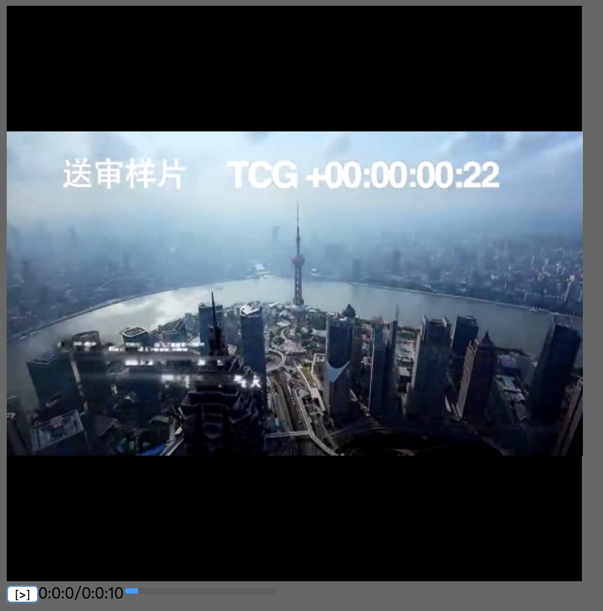

--------------------------------------------------
# h265web.js


* Logo designer & Copyright : porschegt23@foxmail.com (QQ:531365872 Discord:numberwolf#8694)

* LICENSE : GPL-3.0 https://www.gnu.org/licenses/gpl-3.0.md
----------------------------------------

* Capture
> 

### Features

* Support all yuv pixel formats

* Support mp4 box

* Play/pause/stop

* Seek with nearly IDR frame

### TodoList

* Seek with P/B Frame

* Toast of remind

* Support HLS/M3u8-Vod

### Setup

>`npm i --save-dev` # devs only

>`npm i` # normally

### Running 

>`npm start` # just want to test and see, open 127.0.0.1:8999

>`npm run dev` # as dev

### Transcoding Your Media File To Hevc Codec

```bash
ffmpeg -i input.mp4 \
-vcodec libx265 -pix_fmt \
-acodec aac -preset medium -maxrate 1000k -bufsize 1000k \
-vtag hev1 \
-y video.mp4
```

### Project Dir Struct

```struct
|-- dist
|-- lib
|-- src
	|-- h265webjs.js
    |-- decoder
        |-- audio.js
        |-- missile.js
        |-- player.js
        |-- hevc-header.js
        |-- hevc-imp.js
    |-- demuxer
        |-- mp4.js
        |-- buffer.js
|-- package.json
|-- play.js
|-- res
	|-- LICENSE
    |-- README_CHINESE.md
|-- README.MD
```


### Q&A
If you have any problems, you can send mail to me, or use QQ to talk with me. ~^_^~

* Email(porschegt23@foxmail.com)
* QQ: 531365872
* Discord:numberwolf#8694

- Wasm made by myself.

----------------------------

