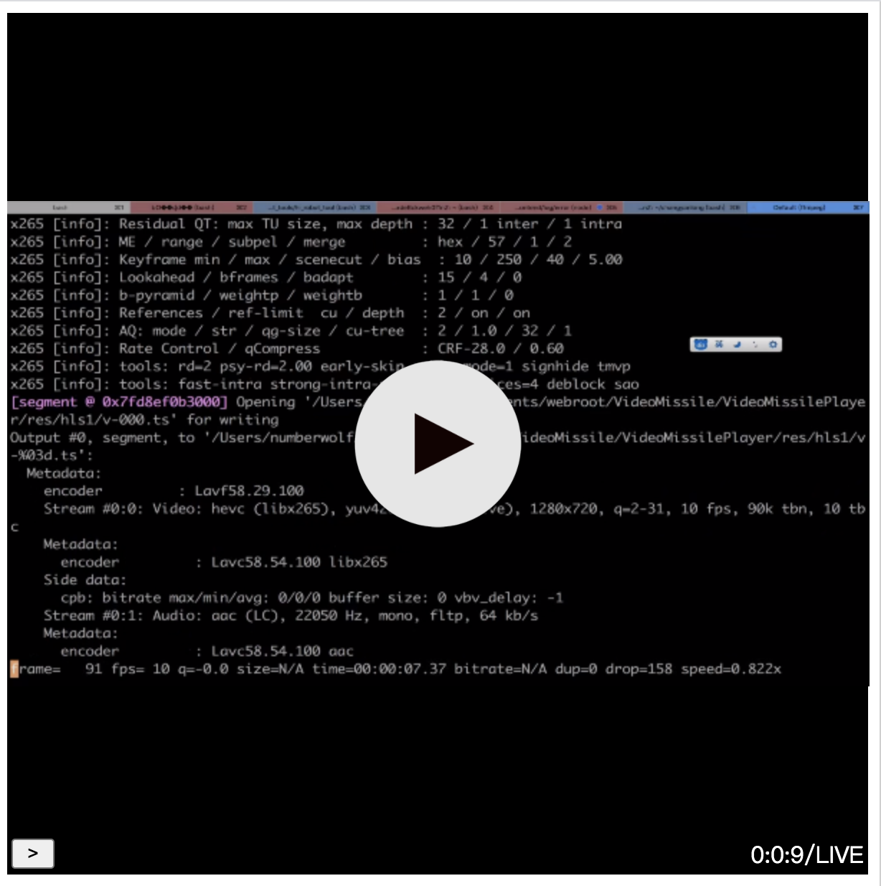

--------------------------------------------------
# h265web.js


* Logo designer & Copyright : porschegt23@foxmail.com (QQ:531365872 ,Discord:numberwolf#8694)

* LICENSE : GPL-3.0 https://www.gnu.org/licenses/gpl-3.0.md

> If h265webjs help you, you can click star button, it offered me more impetus to develop h265webjs!  

> `~^_^~`    


----------------------------------------

#### Capture VOD

##### VOD

> 

##### LIVE

> 

### Features

* Support accurate seek action

* Support HLS Play! (Live Mode!)

* Support M3u8-Vod Play!

* Support M3u8-Vod Seek!

* Support all yuv pixel formats

* Support mp4 box

* Support mpegTS box (depend on: [](https://www.npmjs.com/package/mpeg.js) , (Git: https://github.com/numberwolf/MPEG-Demuxer.js)

* Play/pause/stop

* Seek with nearly IDR frame

* Support Play/Pause control by click player

* Toast of remind

* Protect your website video playing keep away from malicious adver

* Fixed Bug : M3u8 Seek

### TodoList

* Full Screen play

* Player UI refactor

### Setup

> Check wasm support: https://www.caniuse.com/#search=wasm

> `npm i` # normally

### Example

> 1. You can running demo on Running Step.

> 2. How to use it? See play.js + index.html

### Running 

>`npm start` # just want to test and see, open 127.0.0.1:8999

### Transcoding Your Media With HEVC Codec

##### MP4

```bash
ffmpeg -i input.mp4 \
-vcodec libx265 -pix_fmt \
-acodec aac -ac 2 -ar 44100 \
-preset medium -maxrate 1000k -bufsize 1000k \
-vtag hev1 \
-y video.mp4
```

##### MPEG-TS

```bash
ffmpeg -ss 20 -t 10 -i ./res/xinxiaomen.mp4 \
-vcodec libx265 -x265-params "bframes=0:keyint=10" -r 24 -filter_complex "scale=720:1280" -preset fast -maxrate 800k -bufsize 800k \
-acodec aac -ar 22050 -ac 1 \
-pix_fmt yuv420p \
-f mpegts -y ./res/veilside2.ts
```

##### HLS/M3U8

> Capture your screen

```bash
ffmpeg -f avfoundation -i 1:0 \
-q 4 -r 10 \
-filter_complex "scale=1280:720" \
-pix_fmt yuv420p \
-vcodec libx265 \
-ar 22050 -ab 64k -ac 1 -acodec aac \
-threads 4 \
-preset veryfast \
-f segment \
-segment_list test.m3u8 \
-segment_time 5 \
-y /Users/numberwolf/Documents/webroot/VideoMissile/VideoMissilePlayer/res/hls1/v-%03d.ts
```

### Project Dir Struct

```struct
|-- dist
|-- lib
|-- src
    |-- h265webjs.js
    |-- decoder
        |-- audio.js
        |-- missile.js
        |-- player.js
        |-- hevc-header.js
        |-- hevc-imp.js
    |-- demuxer
        |-- mp4.js
        |-- buffer.js
|-- package.json
|-- play.js
|-- res
|-- LICENSE
|-- README_CHINESE.md
|-- README.MD
```


### Q&A
If you have any problems, you can send mail to me, or use QQ to talk with me. ~^_^~

* Email(porschegt23@foxmail.com)
* QQ: 531365872
* Discord:numberwolf#8694

- Wasm made by myself.

----------------------------

