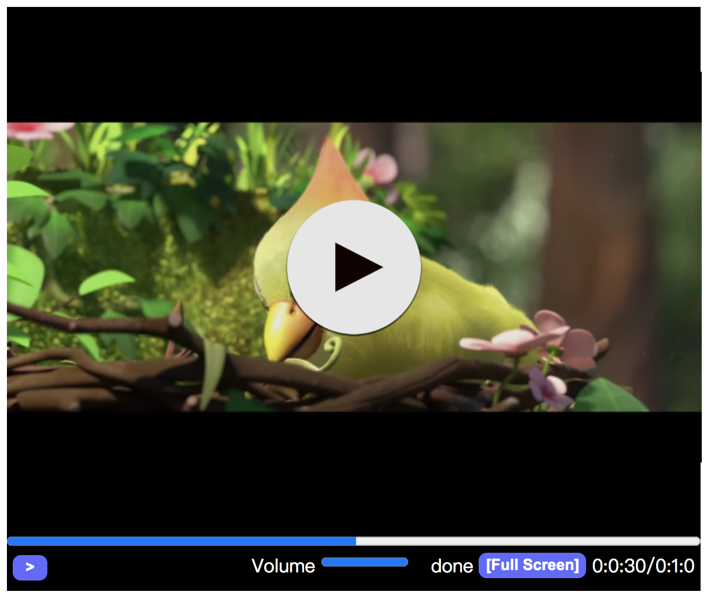
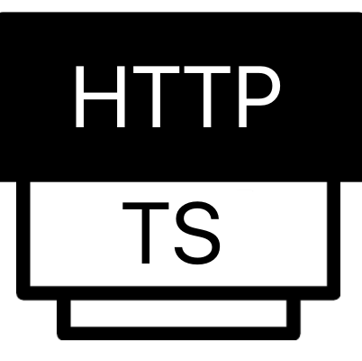
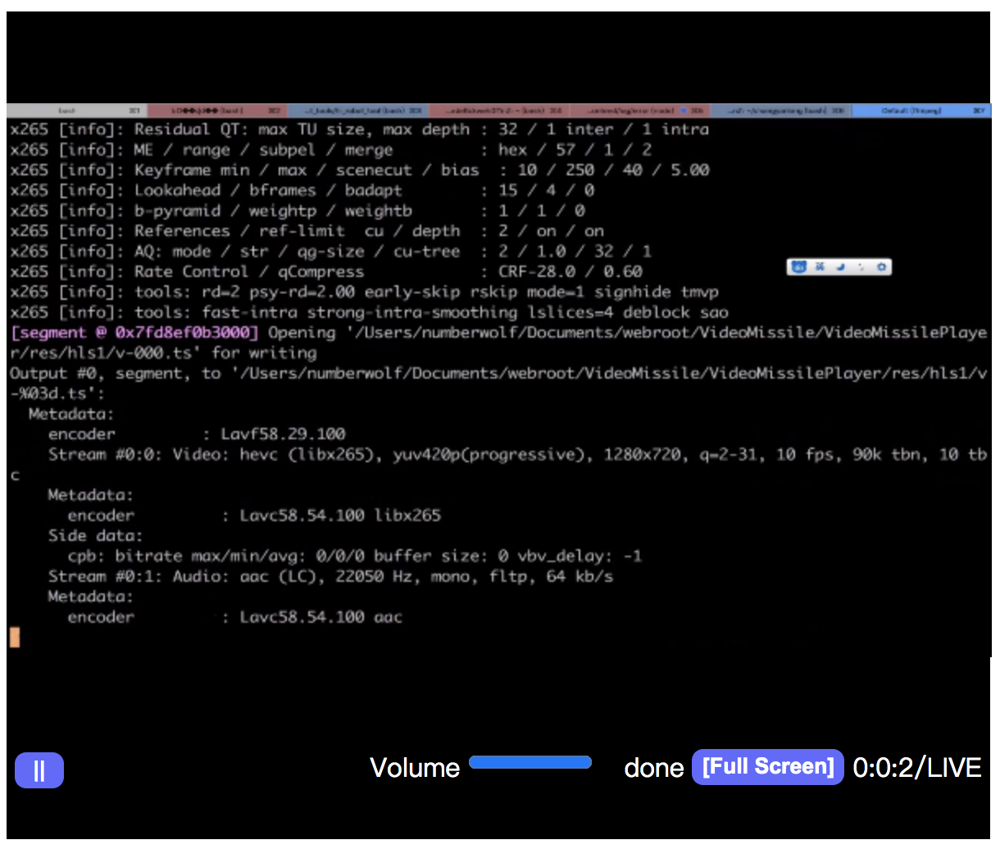

# h265web.js - 已支持HTTP-FLV 即将支持HDR10!

<a href="README.MD">中文</a> | <a href="README_EN.MD">English</a>

<hr>

<a href="./resource/demo.png">

</a>
<hr>
<strong>
<font color="red">市场上能找到的支持的能力最多的HEVC/H.265网页播放器.</font>
<br>
<font color="blue">流媒体服务推荐用 <a href="https://github.com/ZLMediaKit/ZLMediaKit">ZLMediaKit(https://github.com/ZLMediaKit/ZLMediaKit) - 更好用的流媒体服务</a></font>
</strong>
<br>
一个可支持HEVC/H.265编码播放360P、480P、540P、720P、1080P的HEVC播放器 
<br>

<hr>
<h3>能力矩阵</h3>

<strong>
<font color="black">

| <font color="gray">Feature</font> | <font color="gray">Feature</font> | <font color="gray">Feature</font> | <font color="gray">Feature</font> |
| ---- | ---- | ---- | ---- |
|  |  |  |  | 
| HLS(LIVE)| M3u8(VOD) | MP4(VOD) | FLV(VOD) | 
| <br> | <br> | <br> | <br> |
|  |  |  |  |
| HTTP-FLV(LIVE) | HTTP-TS(LIVE) | WS-FLV(LIVE) | WS-TS(LIVE) |
| <br> | <br> | <br> | <br> |
|  |  | <br>商业化 |  . |
| MPEG-TS(VOD) | G711A | HDR10(BT2020) | . |

</font>
</strong>

#### 联系我

* <strong><font color="red">QQ技术支持群: 925466059</font></strong>
* <strong><font color="red">微信: numberwolf11(私聊咨询付费, 免费技术咨询请加QQ群)</font></strong>
* Github: https://github.com/numberwolf
* Email: porschegt23@foxmail.com
* Discord:numberwolf#8694

#### 在线DEMO <a href="https://www.zzsin.com/h265webjs.html"> h265webjs.html (请以Github最新为准,在线Demo已长时间未更新)
</a>

#### 简易Demo - 方便读代码 <a href="index-debug.html">index-debug.html</a>


<br>

| h265web.js | mpeg.js `(解析ts)` | h265web.js 底层265解码器SDK | LICENSE |
| ---- | ---- | ---- | ---- |
| [h265web.js](https://github.com/numberwolf/h265web.js)  | [MPEG-Demuxer.js](https://github.com/numberwolf/MPEG-Demuxer.js) | [h265web.js-wasm-decoder](https://github.com/numberwolf/h265web.js-wasm-decoder) | <a href="https://www.gnu.org/licenses/gpl-3.0.md">License GPL-3.0</a> |

<hr>

# Remind!

因为使用软解码能力（浏览器上无法做硬解码加速 与 汇编优化）,故设备电脑配置性能 会 影响播放器性能！

请注意：

* 视频帧率最好 <= 30fps
	* 建议：24fps

* 视频码率最好 <= 1.5Mb
	* 建议：300~600kbps (HEVC/H.265可提供较高的压缩率)

## 目录

- [更新日志](#更新日志)

- [0-说明](#0-说明)

	- [当前能力](#当前能力)

	- [当前版本token](#当前版本的token)

	- [线上demo](#线上demo)

	- [效果预览](#效果预览)

- [1-快捷方式使用](#1-快捷方式使用)

- [2-播放器SDK使用文档](#2-播放器sdk使用文档)

	- [安装](#安装)

	- [播放器配置](#播放器配置)

	- [初始化播放器](#初始化播放器)

	- [播放器相关事件绑定](#播放器相关事件绑定)

		- [Seek完成](#seek完成)

		- [YUV帧数据渲染](#yuv帧数据渲染)

		- [媒体文件加载完成事件](#媒体文件加载完成事件)

		- [播放器当前播放PTS时刻更新](#播放器当前播放pts时刻更新)

		- [播放器媒体播放结束事件](#播放器媒体播放结束事件)

		- [播放器缓冲进度回调](#播放器缓冲进度回调)

		- [播放器封面图加载完成](#播放器封面图加载完成)

		- [当前正在缓存帧数据](#当前正在缓存帧数据)

		- [帧数据缓存完成](#帧数据缓存完成)

		- [开启全屏事件](#开启全屏事件)

		- [关闭全屏事件](#关闭全屏事件)

	- [播放器API能力](#播放器api能力)

		- [加载播放器](#加载播放器)

		- [获取当前播放状态](#获取当前播放状态)

		- [开始播放](#开始播放)

		- [暂停播放](#暂停播放)

		- [渲染过程中回调YUV帧数据](#渲染过程中回调yuv帧数据)

		- [Seek跳转到某个时刻](#seek跳转到某个时刻)

		- [调整音量](#调整音量)

		- [获取媒资数据 - 并判断是否是H265编码视频](#获取媒资数据)

		- [全屏播放](#全屏播放)

		- [退出全屏播放](#退出全屏播放)

		- [释放播放器](#释放播放器)

- [3-其它](#3-其它)

	- [捐赠](#捐赠)

	- [FFmpeg支持265的HTTPFLV直播](#ffmpeg支持265的httpflv直播)
	
	- [FFmpeg转码265编码的视频](#ffmpeg转码265编码的视频)

<hr>

### 0 说明 ###

| @TODO | 内容 |
| ---- | ---- |
| 1 | 增加HDR10 BT.2020能力 |

<br>

#### 当前能力 ####

* 协议

| 协议  | 模式 | 是否支持 | 说明 |
| ---- | ---- |  ----  | ---- |
| mp4 | 点播 |  是  | ---- |
| ts | 点播 |  是  | ---- |
| m3u8 | 点播 |  是  | ---- |
| hls | 直播 |  是  | ---- |
| HEVC/H.265 | 点播 |  是  | ---- |
| HEVC/H.265 | 直播 |  是  | ---- |
| AVC/H.264 | 点播 |  是  | ---- |
| AVC/H.264 | 直播 |  是  | ---- |
| http-flv | 直播 |  是  | CodecID=12 |
| flv | 点播 |  是  | 备用播放内核模式,不需要填写 |
| websocket-flv | 直播 |  是  | ---- |
| websocket-ts | 直播 |  是  | ---- |
| http-ts | 直播 |  是  | ---- |

* 能力

|  能力 | 是否支持 | 其他 |
| ---- | ---- |  ----  |
| 直播 | 是 |  ----  | ---- |
| 点播 | 是 |  ----  | ---- |
| Seek跳转 | 是 | ---- | ---- |
| 精准Seek | 是 |  ----  | ---- |
| 封面图 | 是 |  ----  | ---- |
| 边下边播 | 是 |  ----  | ---- |
| 音量调节 | 是 |  ----  | ---- |
| 播放 | 是 |  ----  | ---- |
| 暂停 | 是 |  ----  | ---- |
| 重新播放 | 是 |  ----  | ---- |
| 暂停截图 | 是 |  ----  | ---- |
| 1080p播放 | 是 |  ----  | ---- |
| 720p播放 | 是 |  ----  | ---- |
| 多路播放 | 是 |  ----  | ---- |
| 去音频播放 | 是 |  ----  | ---- |
| 缓冲进度 | 是 |  ----  | ---- |
| 开启全屏播放 | 是 |  ----  | ---- |
| 退出全屏播放 | 是 |  ----  | ---- |

<br>

#### 当前版本的token ####

```javascript
token = "base64:QXV0aG9yOmNoYW5neWFubG9uZ3xudW1iZXJ3b2xmLEdpdGh1YjpodHRwczovL2dpdGh1Yi5jb20vbnVtYmVyd29sZixFbWFpbDpwb3JzY2hlZ3QyM0Bmb3htYWlsLmNvbSxRUTo1MzEzNjU4NzIsSG9tZVBhZ2U6aHR0cDovL3h2aWRlby52aWRlbyxEaXNjb3JkOm51bWJlcndvbGYjODY5NCx3ZWNoYXI6bnVtYmVyd29sZjExLEJlaWppbmcsV29ya0luOkJhaWR1";
```

<br>

#### 线上demo ####

<a href="https://www.zzsin.com/h265webjs.html">https://www.zzsin.com/h265webjs.html</a>

简易Demo - 方便读代码 <a href="index-debug.html">index-debug.html</a>

<br>

#### 效果预览 ####

| 类型 | 示例图 |
| ---- | ---- |
| 点播 | <a href='./resource/demo.png' target="_blank"></a> |
| 直播 | <a href='./resource/demo2.png' target="_blank"></a> |

<br>

## 1 快捷方式使用 ##

* 简易Demo - 方便读代码 <a href="index-debug.html">index-debug.html</a>

* 本项目可以直接放在你的`web服务器`目录下访问`index.html`

<br>

## 2 播放器SDK使用文档 ##

简易Demo - 方便读代码 <a href="index-debug.html">index-debug.html</a>

———————— __API以及事件能力__

#### 如果想使用底层的265解码器能力 可以看 [h265web.js-wasm-decoder](https://github.com/numberwolf/h265web.js-wasm-decoder)

### 安装 ###

> * <h4> 注意：不要从npm商店引入！ 请用github仓库下载后引入！ 因为npm商店对wasm不友好</h4>

> * <h4> 注意：.wasm 文件请放置于 你通过`webpack`/`browerify`等打包工具打包出来的js相同目录下！不然无法使用！！！或者直接用我打包好的dist文件夹下的js和wasm单独引入</h4>

#### 1）引入包

* 用普通js(不编译)直接引入原始js文件
	
	* 简易Demo - 第一次使用看这里 <a href="index-debug.html">index-debug.html</a>

	* demo: <a href="./example_normal">example_normal</a>

	```javascript
	<script src="dist/missile.js"></script>
	<script src="dist/h265webjs-v20211016.js"></script>
	```

* 用ES编译引入的语法

	* demo: <a href="./example">example</a>

	* 方式1.1：引入Github的本地文件 `require`形式 

	```javascript
	// 在index.html引入wasm
	<script src="dist/missile.js"></script>
	// 在js文件引入Github的本地文件
	require('./dist/h265webjs');
	```

	* 方式1.2：引入Github的本地文件 `import xxx from xxx`形式 （推荐）

	```javascript
	// 在index.html引入wasm
	<script src="dist/missile.js"></script>
	// 在js文件 引入Github的本地文件
	import H265webjsModule from './dist/index';
	```

<br>

#### 2）安装Wasm

* 从Github下载dist。

<br>

#### 3）引入h265web.js到你的项目

* 本地引入（从Github <a href="https://github.com/numberwolf/h265web.js">h265web.js</a>）

<br>

### 播放器配置 ###

* 创建代码如下

```javascript
const PLAYER_CORE_TYPE_DEFAULT = 0; // 默认播放器内核
const PLAYER_CORE_TYPE_CNATIVE = 1; // 实验播放器内核

var config = {
    player: "glplayer",
    width: 960,
    height: 540,
    token : token,
    extInfo : {
        moovStartFlag : true
    }
};
```

* 配置详解

|  配置项 | 类型 | 可选值 | 必填 | 说明 | 
|  ----  | ----  | ---- | ---- | ---- |
| type  | String | mp4/hls/ts/raw265/flv | 否 | 播放文件的类型,不填写自动识别 |
| player  | String | - | 是 | 播放窗口的dom的id值 |
| width  | Int | - | 是 | 播放窗口的宽度 |
| height  | Int | - | 是 | 播放窗口的高度 |
| token  | String | - | 是 | 播放器token值 |
| extInfo  | Object | - | 否 | 播放器额外配置 |
| \+ moovStartFlag  | Bool | true/false | 否:默认false | Mp4的moov box是否前置 关联到动态加载 |
| \+ rawFps  | Float32 | 例如:30 | 否:默认24 | HEVC/AVC裸流播放时候的帧率设定 |
| \+ autoCrop  | Bool | - | 否:默认false | 如果播放器配置的长宽与视频纵横比不匹配，自动裁剪黑边区域 |
| \+ core  | Int | - | 否:默认0 | 0:默认播放内核 <br>1:备用播放内核 |
| \+ coreProbePart  | Float32 | - | 否:默认1.0 | 探测Mp4媒体的属性，百分比 `0.0~1.0`,正常moov前置的文件都用0.1(10%)可以（只适用于备用播放内核) |
| \+ ignoreAudio | Int | - | 否:默认0 | 0:带音频播放 <br>1:忽略音频播放 |
| \+ probeSize | Int | - | 否:4096 | HTTP-FLV直播模式下的探测长度 |


<br>

### 初始化播放器 ###

* 务必注意！！！

<strong>请将你整体项目最终编译出来的`JS目标文件` 与 `wasm文件`放置于`同一级目录`</strong>

* 例如

```c
	./dist/你最终编译产出.js
	./dist/sdk file
	./index.html
```

* 创建方法(全局方法) 

> new265webjs(`播放地址`, `播放器配置`)

|  参数 | 类型 | 默认值 | 必填 | 说明 | 
|  ----  | ----  | ---- | ---- | ---- |
| 播放地址  | String | - | 是 | 播放视频地址 |
| 播放器配置  | Object | - | 是 | 播放器配置信息 |

* 创建示例Demo

	* 1）路径 + 配置
		* 例子1 创建 `mp4/hls/ts`类型播放器

		```javascript
		let videoURL = "h265_test.mp4";
		let config = {
		    player: "glplayer",
		    width: 960,
		    height: 540,
		    token : token,
		    extInfo : {
		        moovStartFlag : true
		    }
		};
		````

		* 例子2 创建`raw265`类型 播放h265裸流 播放器（包括直播）

		```javascript
		let config = {
		    type: "raw265",
		    player: "glplayer",
		    width: 960,
		    height: 540,
		    token : token,
		    extInfo : {
		        rawFps : 30 // 播放帧率
		    }
		};

		* 例子3 创建`FLV`点播播放器

		```javascript
		const PLAYER_CORE_TYPE_DEFAULT = 0; // 默认播放器
        const PLAYER_CORE_TYPE_CNATIVE = 1; // 备用播放内核
		let config = {
            player: "glplayer",
            width: 960,
            height: 540,
            token : token,
            extInfo : {
                moovStartFlag : true,
                coreProbePart : 0.1,
                ignoreAudio : 0
            }
        };
		````

	* 2）创建播放器

		* 0. 以普通script src方式引入

		示例:
		```javascript
		let player = window.new265webjs(url, config);
		```

		* 1. 以`require('./src/h265webjs');`引入为前提

		示例：
		```javascript
		let player = new265webjs(videoURL, config); // 全局方法
		```

		* 2. 以`import H265webjsModule from './dist/index';`引入为前提 （推荐）

		示例：
		```javascript
		let player = H265webjsModule.createPlayer(videoURL, config);
		```

		* 3. 如果创建的是`raw265`类型的裸流数据播放 请注意
			> 这部分fetch请求网络数据以及异步喂数据的过程 请自行改写,下面给出的仅仅是一个demo,网络IO和解析265流为帧数据会非常耗时。
			>   
			> 如果你可以通过websocket直接一帧一帧传输的话，那么只需要调用喂265数据的函数即可。

			* `raw265`类型下，喂一帧一帧H.265播放

			调用函数

			|  函数 | 返回 | 说明 | 
			|  ----  | ----  | ---- |
			| append265NaluFrame  | NULL | 喂一帧265数据 |

			参数

			| 参数 | 类型 | 默认值 | 必填 | 说明 | 
			|  ----  | ----  | ---- | ---- | ---- |
			| frame  | Uint8Array | - | 是 | 一帧265数据 |

			例子 - 这里直接将265文件通过网络串流传输

			```javascript
			//
		    // fetch 265
		    // you can use your code to fetch vod stream
		    // only need `h265webjs.append265NaluFrame(nalBuf);` to append 265 frame
		    //
		    let rawParser = new RawParserModule();

		    let fetchFinished = false;
		    let startFetch = false;
		    let networkInterval = window.setInterval(() => {
		        if (!startFetch) {
		            startFetch = true;
		            fetch(url265).then(function(response) {
		                let pump = function(reader) {
		                    return reader.read().then(function(result) {
		                        if (result.done) {
		                            // console.log("========== RESULT DONE ===========");
		                            fetchFinished = true;
		                            window.clearInterval(networkInterval);
		                            networkInterval = null;
		                            return;
		                        }
		                        let chunk = result.value;
		                        rawParser.appendStreamRet(chunk);
		                        return pump(reader);
		                    });
		                }
		                return pump(response.body.getReader());
		            })
		            .catch(function(error) {
		                console.log(error);
		            });
		        }
		    }, 1);

		    // fps>=30 play else cache
		    let naluParseInterval = window.setInterval(() => {
		        if (nalBuf != false) {
		            // require
		            h265webjs.append265NaluFrame(nalBuf);
		        } else if (fetchFinished) {
		            window.clearInterval(naluParseInterval);
		            naluParseInterval = null;
		        }
		    }, 1);
			```

<br>

### 播放器相关事件绑定 ###

#### Seek完成 ####

> 主要用于SEEK完成做一些操作

* 示例

```javascript
player.onSeekFinish = () => {
    // todo
};
```

<br>

#### YUV帧数据渲染 ####

|  回调参数 | 类型 | 默认值 | 必填 | 说明 | 
|  ----  | ----  | ---- | ---- | ---- |
| width  | int | - | - | YUV宽度 |
| height  | int | - | - | YUV高度 |
| imageBufferY  | Uint8Array | - | - | Y分量 |
| imageBufferB  | Uint8Array | - | - | ChromaB分量 |
| imageBufferR  | Uint8Array | - | - | ChromaR分量 |

> 可以利用事件回调的YUV做全屏播放

> 需要调用 `setRenderScreen` 函数开启才可以收到事件回调数据, 下方`1.5 API`会说明

* 示例

```javascript
player.onRender = (width, height, imageBufferY, imageBufferB, imageBufferR) => {
	// todo
};
```

<br>

#### 媒体文件加载完成事件 ####

> 媒体文件当前加载成功，可以进行播放

* 示例

```javascript
player.onLoadFinish = () => {
	// todo
};
```

<br>

#### 播放器当前播放PTS时刻更新 ####

|  回调参数 | 类型 | 默认值 | 必填 | 说明 | 
|  ----  | ----  | ---- | ---- | ---- |
| videoPTS  | float64 | - | - | 当前播放时间 |

* 示例

```javascript
player.onPlayTime = (videoPTS) => {
	// todo
	console.log(videoPTS)
};
```

#### 播放器媒体播放结束事件 ####

* 示例

```javascript
player.onPlayFinish = () => {
    // finished
};
```

#### 播放器缓冲进度回调 ####

|  回调参数 | 类型 | 默认值 | 必填 | 说明 | 
|  ----  | ----  | ---- | ---- | ---- |
| cPts  | float64 | - | - | 当前缓冲进度时间 |

* 示例

```javascript
player.onCacheProcess = (cPts) => {
    // console.log("onCacheProcess => ", cPts);
};
```

#### 播放器封面图加载完成 ####

* 示例

```javascript
player.onReadyShowDone = () => {
    // console.log("onReadyShowDone");
    // to play 封面图加载完成了
};
```

#### 当前正在缓存帧数据 ####

* 示例

```javascript
player.onLoadCache = () => {
	// caching frames
};
```


#### 帧数据缓存完成 ####

* 示例

```javascript
player.onLoadCacheFinshed = () => {
    // cache finished
};
```

#### 开启全屏事件 ####

* 示例

```javascript
player.onOpenFullScreen = () => {
    // todo
};
```

#### 关闭全屏事件 ####

* 示例

```javascript
player.onCloseFullScreen = () => {
    // todo
};
```


<br>

### 播放器API能力 ###

#### 加载播放器 ####

> 一般在配置完成【播放器配置】和【事件】之后进行播放器加载

* 示例

```javascript
player.do();
```

<br>

#### 获取当前播放状态 ####

|  调用函数 | 返回 | 说明 |
|  ---- | ----  | ---- |
| isPlaying() | bool | 是否正在播放中 |

* 示例

```javascript
if (player.isPlaying()) {
	// 正在播放中
} else {
	// 当前是暂停状态
}
```

<br>

#### 开始播放 ####

|  调用函数 | 返回 | 说明 |
|  ----  | ----  | ---- |
| play()  | - | 开始播放 |

* 示例

```javascript
player.play();
```

<br>

#### 暂停播放 ####

|  调用函数 | 返回 | 说明 |
|  ----  | ----  | ---- |
| pause()  | - | 暂停播放 |

* 示例

```javascript
player.pause();
```

<br>

#### 渲染过程中回调YUV帧数据 ####

> 开启之后，`onRender`事件才可以收到数据

|  调用函数 | 返回 | 说明 |
|  ----  | ----  | ---- |
| setRenderScreen(`{param1}`)  | - | 开启/关闭渲染过程中 回调YUV帧数据 |

* 参数

|  参数 | 类型 | 默认值 | 说明 |
|  ----  | ---- | ----  | ---- |
| param1 | bool | false | 开启/关闭渲染过程中 回调YUV帧数据 |

* 示例

```javascript
// 开启
player.setRenderScreen(true);
// 关闭
player.setRenderScreen(false);
```

<br>

#### Seek跳转到某个时刻 ####

|  调用函数 | 返回 | 说明 |
|  ----  | ----  | ---- |
| seek(`{pts}`)  | - | Seek到某一个时刻 |

* 参数

|  参数 | 类型 | 默认值 | 说明 |
|  ----  | ---- | ----  | ---- |
| pts | float64 | - | Seek到某一个时刻的时间点 |

* 示例

```javascript
// Seek到10.01秒
player.seek(10.01);
```

<br>

#### 调整音量 ####

> 调整视频的播放音量

|  调用函数 | 返回 | 说明 |
|  ----  | ----  | ---- |
| setVoice(`{volume}`)  | - | 调整音量 |

* 参数

|  参数 | 类型 | 默认值 | 说明 |
|  ----  | ---- | ----  | ---- |
| volume | float64 | - | 范围区间是`[0, 1.0]`, 0为mute，1.0为全开音量 |

* 示例

```javascript
// 音量开启一半
player.setVoice(0.5);
```

<br>

#### 获取媒资数据 ####

> 获取当前播放的视频文件的信息数据

|  调用函数 | 返回 | 说明 |
|  ----  | ----  | ---- |
| mediaInfo()  | Object | 媒资详情 |

* 返回值示例

```json
meta:
	audioNone: false // 是否不包含音频轨
	durationMs: 600000 // 时长 毫秒级
	fps: 25 // 帧率
	sampleRate: 44100 // 音频采样率
	size: // 视频分辨率
		height: 720
		width: 1280
	videoCodec: 0 // 0:HEVC/H.265 1:其他编码
	isHEVC: true // 是否是H265编码视频
videoType: "vod" // 点播vod 直播live
```

* 示例

```javascript
let mediaInfo = player.mediaInfo();
```
<br>

#### 全屏播放 ####

|  调用函数 | 返回 | 说明 |
|  ----  | ----  | ---- |
| fullScreen()  | - | 全屏播放 |

* 示例

```javascript
player.fullScreen();
```
<br>

#### 退出全屏播放 ####

|  调用函数 | 返回 | 说明 |
|  ----  | ----  | ---- |
| closeFullScreen()  | - | 退出全屏 |

* 示例

```javascript
player.closeFullScreen();
```

<br>

#### 释放播放器 ####

|  调用函数 | 返回 | 说明 |
|  ----  | ----  | ---- |
| release()  | - | 释放播放器资源 |

* 示例

```javascript
player.release();
```


<br>

## 3 其它 ##

### 捐赠 ###

|  微信 | 支付宝 | PayPal |
|  ---- | ----  | ---- |
|  |  | TODO |

<br>

### FFmpeg支持265的HTTPFLV直播 ###

* Github地址: https://github.com/numberwolf/FFmpeg-QuQi-H265-FLV-RTMP

<br>

### FFmpeg转码265编码的视频 ###

* mp4

```bash
ffmpeg -i input.mp4 \
-vcodec libx265 -pix_fmt \
-acodec aac -ac 2 -ar 44100 \
-preset medium -maxrate 1000k -bufsize 1000k \
-vtag hev1 \
-movflags faststart \
-y video.mp4
```

* hls/m3u8 录屏

```bash
ffmpeg -f avfoundation -i 1:0 \
-q 4 -r 10 \
-filter_complex "scale=1280:720" \
-pix_fmt yuv420p \
-vcodec libx265 \
-ar 22050 -ab 64k -ac 1 -acodec aac \
-threads 4 \
-preset veryfast \
-f segment \
-segment_list test.m3u8 \
-segment_time 5 \
-y /Users/numberwolf/Documents/webroot/VideoMissile/VideoMissilePlayer/res/hls1/v-%03d.ts
```

* mpeg-ts

```bash
ffmpeg -ss 20 -t 10 -i ./res/xinxiaomen.mp4 \
-vcodec libx265 -x265-params "bframes=0:keyint=10" -r 24 -filter_complex "scale=720:1280" -preset fast -maxrate 800k -bufsize 800k \
-acodec aac -ar 22050 -ac 1 \
-pix_fmt yuv420p \
-f mpegts -y ./res/veilside2.ts
```

<br>

# 更新日志 #

| 更新日志 | 内容 |
| ---- | ---- |
| 时间 | 2022/01/17 |
| - | 0.解决ISSUE HLS 265内存泄露问题 https://github.com/numberwolf/h265web.js/issues/108   |
| - | 1.解决ISSUE HLS Split Rules https://github.com/numberwolf/h265web.js/issues/105 |
| - | 2.增加新Demo <a href="index-debug.html">index-debug.html</a> |
| - | 3.解决10+窗口264播放引起堆栈异常 |
| 时间 | 2021/12/31 |
| - | 0.增加 H.264 HTTP-FLV 失败后Retry |
| 时间 | 2021/12/24 |
| - | 0.修复 H.264 HTTP-FLV 部分流无回调问题 |
| 时间 | 2021/12/19 |
| - | 0.修复 H.264 HLS 回调不响应的问题 |
| 时间 | 2021/12/08 |
| - | 0.修复 H.264 MP4 onReadyShowDone回调问题 |
| 时间 | 2021/12/04 - 凌晨 |
| - | 0.修复 http-flv 265 渲染上下文Crash问题 |
| - | 1.修复 hls播放全屏错误 |
| - | 2.修复 一些播放问题 |
| 时间 | 2021/11/29 - 夜 |
| - | 0.修复 http-flv起播重试问题、修复一些bug |
| 时间 | 2021/11/25 - 夜 |
| - | 0.修复 httpflv/ws直播 ignoreAudio配置失效问题 |
| 时间 | 2021/11/23 - 夜 |
| - | 0.修复 https://github.com/numberwolf/h265web.js/issues/90 |
| 时间 | 2021/11/21 - 凌晨 |
| - | 0.支持 Websocket-FLV播放 (HEVC/H.265) |
| - | 1.支持 Websocket-TS播放 (HEVC/H.265) |
| - | 2.支持 HTTP-TS播放 (HEVC/H.265) |
| 时间 | 2021/11/16 - 晚 |
| - | 0.视频流首次请求无数据返回则进行重试5次 |
| 时间 | 2021/11/15 - 晚 |
| - | 0.HTTP-FLV直播断流retry重试 7s一次 |
| 时间 | 2021/11/14 - 晚 |
| - | 0.增加256M内存版本的WASM依赖(可内存增长) |
| - | 0.增加512M内存版本的WASM依赖(可内存增长) |
| 时间 | 2021/11/04 - 晚 |
| - | 0.修复频繁release出现crash |
| 时间 | 2021/10/26 - 晚 |
| - | 0.修复一些问题 |
| 时间 | 2021/10/24 - 晚 |
| - | 0.支持AVC/H.264编码的MP4/HLS/M3u8/FLV/HTTP-FLV |
| 时间 | 2021/10/18 - 晚 |
| - | 0.新增DEMO |
| 时间 | 2021/10/16 - 晚 |
| - | 0.修复HTTP-FLV返回Mediainfo的Codec参数不准的问题 |
| - | 1.更新Demo |
| 时间 | 2021/10/14 - 晚 |
| - | 0.修复返回Mediainfo的Codec参数不准的问题 |
| 时间 | 2021/10/13 - 晚 |
| - | 0.兼容VUE等框架IDE调试问题,剥离WASM模块单独Script引入 |
| 时间 | 2021/10/12 - 晚 |
| - | 0.支持HTTP-FLV(HEVC) 兼容无帧率参数视频,优化 |
| 时间 | 2021/10/09 - 凌晨 |
| - | 0.支持HTTP-FLV(HEVC) 直播播放 CodecID=12 |
| - | 0.MP4/FLV(VOD) 优化缓存区域外Seek速度性能 |
| 时间 | 2021/09/27 - 晚 |
| - | 0.M3u8/MpegTS 优化缓存区域外Seek速度性能 |
| 时间 | 2021/09/25 - 凌晨 |
| - | 0.HLS直播 解决长时直播内存泄露问题 |
| - | 1.HLS直播 解决HLS TS分片全路径不兼容问题 |
| - | 2.HLS直播 解决断流导致停播问题 |
| - | 3.HLS直播 解决网络不稳定导致停播问题 |
| 时间 | 2021/09/08 - 晚 |
| - | 0.M3U8 Seek导致花屏问题 |
| - | 1.MP4 部分用户上报花屏问题 |
| - | 2.入口配置项缩减,部分配置选项去除,改为自动化配置 |
| 时间 | 2021/09/07 - 晚 |
| - | 0.M3U8 内核解决部分解析错误 |
| 时间 | 2021/09/07 - 凌晨 |
| - | 0.备用播放内核更新 - 点播MP4/FLV Seek BUG解决不能seek 0, 播放性能优化 |
| 时间 | 2021/08/15 |
| - | 0.H265/HEVC 原始流文件/直播 播放优化、Demo优化 |
| 时间 | 2021/07/18 |
| - | 0.播放器UI改造升级 |
| - | 1.支持全屏播放能力 |
| - | 2.全屏播放回调事件 |
| 时间 | 2021/07/11 |
| - | 0.兼容 ZLMediaKit + 华为摄像头推的流 |
| 时间 | 2021/07/04 |
| - | 0.修复 <a href="https://github.com/numberwolf/h265web.js/issues/58">`ISSUE#58`</a> (默认内核缓存状态下的暂停问题) |
| 时间 | 2021/07/01 |
| - | 0.增加示例 与 编译所需 |
| 时间 | 2021/06/27 |
| - | 0.开源! |
| - | 1.支持了FLV视频播放Seek能力 |
| - | 2.解决了新播放内核的SEEK问题 |
| - | 3.FLV播放新类型支持, 以及不需要设置播放内核 |
| 时间 | 2021/05/30 |
| - | 1.解决了一些Seek和播放的bug(比较重要的升级) |
| - | 2.播放器封面图加载完成 事件通知 |
| 时间 | 2021/05/24 |
| - | 1.FLV点播支持(在备用播放内核模式下可用) |
| 时间 | 2021/05/21 |
| - | 1.HLS(无声直播)性能优化 |
| 时间 | 2021/05/18 |
| - | 1.HLS(直播)性能优化、增加声音Case |
| 时间 | 2021/05/16 |
| - | 1.MP4点播兼容BD265产出部分特殊box case |
| 时间 | 2021/05/15 |
| - | 1.修复HLS直播的部分问题 以及嵌套型的HLS |
| 时间 | 2021/04/27 |
| - | 1.修复部分视频播放中马赛克问题 |
| - | 2.修复部分视频第一个GOP马赛克问题 |
| 时间 | 2021/04/22 |
| - | 1.备用播放内核模式 增加Seek功能 |
| - | 2.备用播放内核模式 兼容yuvj420p |
| - | 3.一些其他细节的完善 |
| 时间 | 2021/04/12 |
| - | 1.修复了默认内核播放 hev错误的问题 |
| - | 2.修复了默认内核播放 部分nalu错误的问题 |
| - | 3.修复了默认内核播放 部分花屏问题 |
| 时间 | 2021/04/07 |
| - | 1.时长错误问题 |
| 时间 | 2021/03/28 |
| - | 1.增加缓冲进度条 |
| - | 2.解决了一些Bug，优化了一些性能 |
| - | 3.移出HLS播放的无用日志 |
| - | 4.增加去音频播放选项(新内核) |
| 时间 | 2021/03/14 |
| - | 1.备用播放内核模式 |
| 时间 | 2021/03/12 |
| - | 1.很抱歉,这几天事情交织在一起,有些累,因为我的个人疏忽,导致HLS/M3u8能力不可用,今天已紧急修复. ~_~! 谢谢所有支持h265web的工程师朋友们！ |
| 时间 | 2021/03/06 |
| - | 1.备用播放内核模式，解决多路窗口播放加载失败问题 |
| 时间 | 2021/02/28 |
| - | 1.开放给H.265解码器喂完整的265nalu帧函数 `append265NaluFrame(nalBuf);` |
| - | 2.开放新库，解析h265流为帧数据的工具 [raw-parser.js](./dist/raw-parser.js) |
| 时间 | 2021/02/21 |
| - | 1.更新底层265解码器SDK项目 - [https://github.com/numberwolf/h265web.js-wasm-decoder](https://github.com/numberwolf/h265web.js-wasm-decoder) |
| 时间 | 2021/02/18 |
| - | 1.备用播放内核模式，增加音频播放能力 |
| 时间 | 2021/02/08 |
| - | 1.增加播放内核类型：备用播放内核模式，可兼容多种解码Badcase(测试阶段, 输入媒资Mp4Box需要前置Moov，当前还不支持音频、Seek) |
| 时间 | 2021/01/04 |
| - | 1.支持H.265的流式接入，可直接以265的URI进行播放、也可以流式字节填充播放（可应用于直播） |
| - | 2.取消了播放器自带的播放view蒙板（用于点击播放画面触发暂停/播放能力），开放给用户自行实现 |
| - | 3.支持 如果播放器配置的长宽与视频纵横比不匹配，自动裁剪黑边区域 |
| - | 4.增加`onPlayFinish` 事件回调，播放结束调用 |


<hr>


