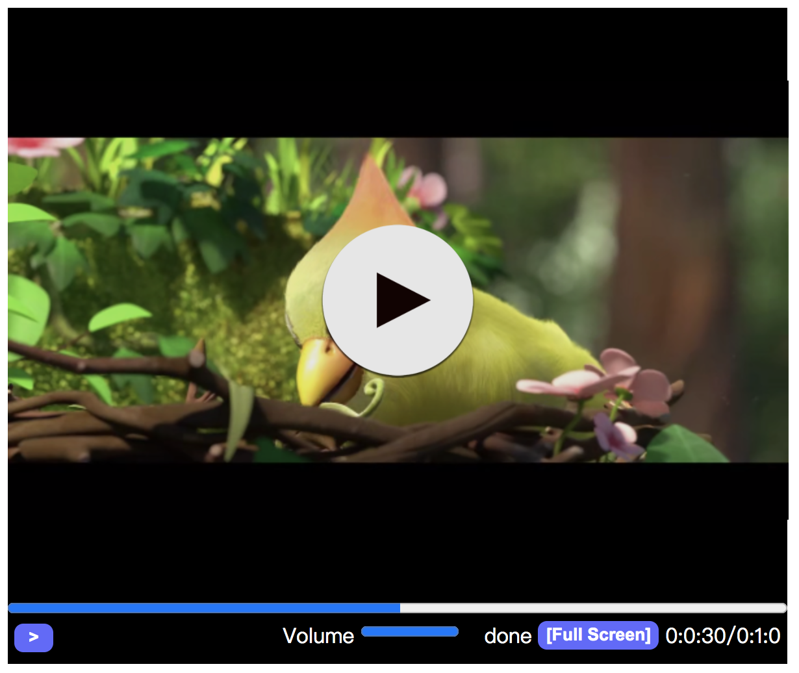
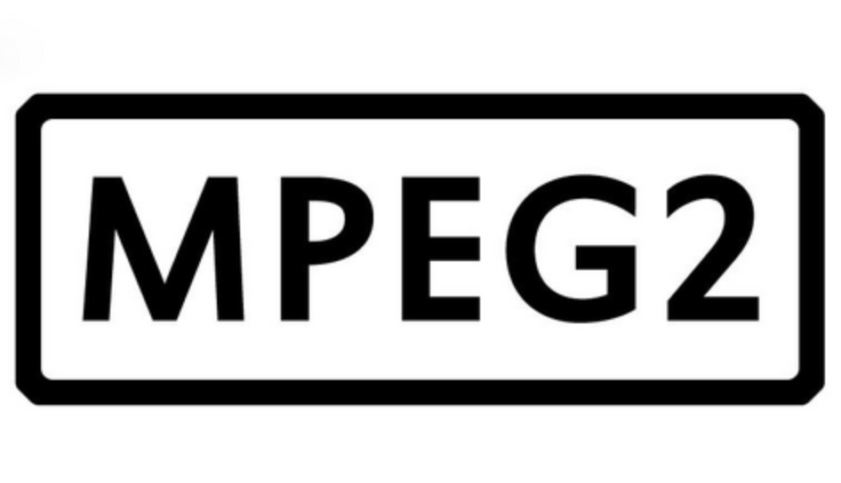
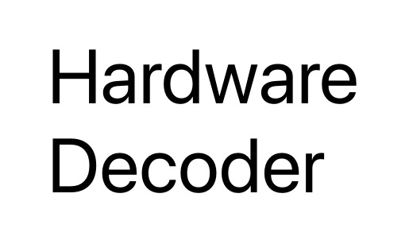
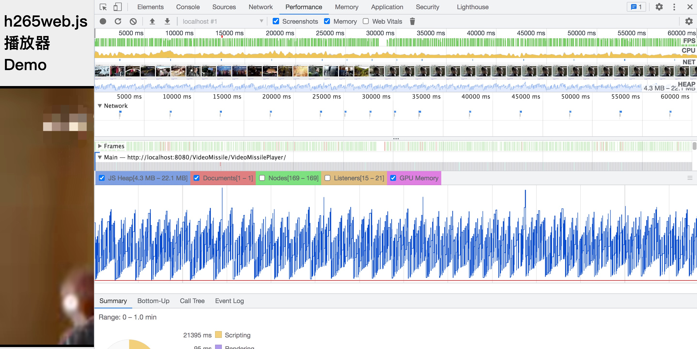

# h265web.js - Browser HEVC/H.265 Playback SDK

<p align="center">
  <a href="README_CN.MD">中文</a> · <a href="README.MD">English</a>
</p>

<p align="center">
  
  &nbsp;&nbsp;&nbsp;
  
</p>

<p align="center">
  <a href="https://h265web.com/markdown-docs/get-started.php"></a>
  <a href="https://h265web.com/"></a>
  <a href="https://h265web.com/player.php"></a>
  <a href="https://github.com/numberwolf/h265web.js"></a>
</p>

> **Built and refined continuously since 2017, h265web.js PRO delivers mature browser playback with broad feature coverage and strong performance.**
>
> It covers HEVC/H.265, AVC/H.264, AV1, live streaming, VOD, WebCodec, WASM decoding, MediaInfo, snapshot, fullscreen, seek and multi-instance playback.
>
> **Recommended media server:** [ZLMediaKit](https://github.com/ZLMediaKit/ZLMediaKit) - a strong streaming server/framework for live and VOD delivery.

If [h265web.js](https://github.com/numberwolf/h265web.js) helps your project, a GitHub star is always appreciated.

## Quick Links

- GitHub: https://github.com/numberwolf/h265web.js
- Docs: https://h265web.com/markdown-docs/get-started.php
- Website: https://h265web.com/
- Public Demo: https://h265web.com/player.php

## Contact

- GitHub: https://github.com/numberwolf/h265web.js
- Email: porschegt23@foxmail.com
- QQ Group Number: 925466059 (recommended)
- QQ: 531365872
- Discord: numberwolf#8694
- Wechat: numberwolf11

## Demo Entry

- Public Demo: https://h265web.com/player.php
- Docs: https://h265web.com/markdown-docs/get-started.php

### Good Fit For

- Browser playback of HEVC/H.265, AVC/H.264 and AV1
- VOD and live playback in one SDK
- Protocol validation for MP4 / MOV / MKV / FLV / MPEG-TS / M3U8 / HLS / HTTP-FLV / WS-FLV / HTTP-TS / WS-TS / HEVC ES
- Browser-side player projects that need seek, playbackRate, fullscreen, snapshot, MediaInfo, multi-instance playback and multi-thread decode

### Feature Matrix

| Feature | Feature | Feature | Feature |
| ---- | ---- | ---- | ---- |
|  |  |  |  | 
| HLS(LIVE)| M3u8(VOD) | MP4(VOD) | FLV(VOD) | 
| <br> | <br> | <br> | <br> |
|  |  |  |  |
| HTTP-FLV(LIVE) | HTTP-TS(LIVE) | WS-FLV(LIVE) | WS-TS(LIVE) |
| <br> | <br> | <br> | <br> |
|  |  |  | |
| MPEG-TS(VOD) | MPEG-PS(VOD) | AV1(Chrome) | MOV(H.265) |
| <br> | <br> | <br> | <br> |
|  |  | <br> |  |
| HTTP-HEVC | WS-HEVC | MKV(HEVC) | AAC(MAIN/LC) |
| <br> | <br> | <br> | <br> |
|  |  |  |  |   |
| Multi-Thread<br><font color="red">(only:<br>https+nginx conf)</font> | Single-Thread | G711A(HTTP-FLV) | G711U(HTTP-FLV) |
| <br> | <br> | <br> | <br> |
|  |  |  |  |
| MediaInfo | HEVC/H.265 | AVC/H.264 | Hardware decoder<br>(FLV/HTTP-FLV/MP4) |

| h265web.js | mpeg.js `(ts demuxer)` | h265web.js's H.265 decoder | LICENSE |
| ---- | ---- | ---- | ---- |
| [h265web.js](https://github.com/numberwolf/h265web.js)  | [MPEG-Demuxer.js](https://github.com/numberwolf/MPEG-Demuxer.js) | [h265web.js-wasm-decoder](https://github.com/numberwolf/h265web.js-wasm-decoder) | <a href="LICENSE-Free_CN.MD">CYL_Free-1.0 LICENSE-Free_CN.MD</a> |

<hr>

### Feature Support ###


#### Supported ####

* Protocol box

|  protocol | model | support | desc |
| ---- | ---- |  ----  | ---- |
| mp4 | Video on demand |  Y  | ---- |
| mov | Video on demand |  Y  | HEVC/H.265 |
| mkv | Video on demand |  Y  | HEVC/H.265 |
| av1 | Video on demand |  Y  | Chrome |
| mpeg-ts | Video on demand |  Y  | ---- |
| mpeg-ps | Video on demand |  Y  | ---- |
| m3u8 | Video on demand |  Y  | ---- |
| hls | Live |  Y  | ---- |
| flv | Video on demand |  Y  | ---- |
| http-flv | Live |  Y  | CodecID=12 |
| http-ts | Live |  Y  | ---- |
| http-hevc | Live |  Y  | ---- |
| http-hevc | Video on demand |  Y  | ---- |
| websocket-hevc | Live |  Y  | ---- |
| websocket-flv | Live |  Y  | ---- |
| websocket-ts | Live |  Y  | ---- |
| HEVC/H.265 | Video on demand |  Y  | ---- |
| HEVC/H.265 | Live |  Y  | ---- |
| AVC/H.264 | Video on demand |  Y  | ---- |
| AVC/H.264 | Live |  Y  | ---- |

* Codec

| Codec | Support | Desc |
| ---- |  ----  | ---- |
| AVC/H.264 |  Y  | ---- |
| HEVC/H.265 |  Y  | ---- |
| AAC |  Y  | ---- |
| G711A |  Y  | HTTP-FLV |
| G711U |  Y  | HTTP-FLV |
| AV1 |  Y  | Chrome |


* Features

|  Feature | Support | Desc |
| ---- | ---- |  ----  |
| Hardware-Decode | Y | For Chrome/Safari etc... |
| WebCodec | Y | Browser-supported hardware path |
| SIMD | Y | WASM + SIMD acceleration path |
| MSE | Y | Browser MSE playback path |
| Video on demand | Y |  ----  |
| Live | Y |  ----  |
| Seek | Y | ----  |
| AccurateSeek | Y |  ----  |
| Cover Image | Y |  ----  |
| Playing with download | Y |  ----  |
| Volume | Y |  ----  |
| Play | Y |  ----  |
| Pause | Y |  ----  |
| ReStart | Y |  ----  |
| PauseWithCoverImage | Y |  ----  |
| 1080P | Y |  ----  |
| 720P | Y |  ----  |
| Create multi players | Y |  ----  |
| Play without Audio | Y |  ----  |
| Cache process | Y |  ----  |
| Open Fullscreen | Y |  ----  |
| Exit Fullscreen | Y |  ----  |
| Play frame by frame | Y |  ----  |
| Snapshot | Y |  ----  |
| Autoplay | Y |  HTTP-FLV 265+264<br>HTTP-TS 265+264<br>HLS 264  |
| Cache Length | Y | MP4 265 |
| Multi-thread decoder | Y | (HTTPS+ Conf NGINX) |
| Single-thread decoder | Y | compatible |
| Get MediaInfo | Y | ---- |
| Get Codec Param | Y | Video&Audio |
| Get Media Duration | Y | Video&Audio |
| Get Video Size | Y | ---- |
| Get Video FPS | Y | ---- |
| Get Audio SampleRate | Y | ---- |
| Chase Frame | Y | HTTP-FLV(no audio) |
| PlayBackRate | Y | H.264/H.265/AV1 |
| Resize | Y | ---- |

<br>

# Donate #

|  Wechat | Alipay | PayPal |
|  ---- | ----  | ---- |
|  |  | - |
<br>

### FFmpegSupportH265LiveEncode ###

* Github: https://github.com/numberwolf/FFmpeg-QuQi-H265-FLV-RTMP

<br>

### TranscodeAndGet265CodecFileByFFmpeg ###

* mp4

```bash
ffmpeg -i input.mp4 \
-vcodec libx265 -pix_fmt \
-acodec aac -ac 2 -ar 44100 \
-preset medium -maxrate 1000k -bufsize 1000k \
-vtag hvc1 \
-movflags faststart \
-y video.mp4
```

* hls/m3u8 capture

```bash
ffmpeg -f avfoundation -i 1:0 \
-q 4 -r 10 \
-filter_complex "scale=1280:720" \
-pix_fmt yuv420p \
-vcodec libx265 \
-ar 22050 -ab 64k -ac 1 -acodec aac \
-threads 4 \
-preset veryfast \
-f segment \
-segment_list test.m3u8 \
-segment_time 5 \
-y /Users/numberwolf/Documents/webroot/VideoMissile/VideoMissilePlayer/res/hls1/v-%03d.ts
```

* mpeg-ts

```bash
ffmpeg -ss 20 -t 10 -i ./res/xinxiaomen.mp4 \
-vcodec libx265 -x265-params "bframes=0:keyint=10" -r 24 -filter_complex "scale=720:1280" -preset fast -maxrate 800k -bufsize 800k \
-acodec aac -ar 22050 -ac 1 \
-pix_fmt yuv420p \
-f mpegts -y ./res/veilside2.ts
```

<br>

# UpdateLog #

| Update | Content |
| ---- | ---- |
| Time | 2026/03/28 |
| - | 0.Update more powerful version |
| Time | 2022/11/06 |
| - | 0.Update |
| Time | 2022/11/02 |
| - | 0.Update WASM |
| Time | 2022/10/22 |
| - | 0.Support: Hard-Decode for FLV/HTTP-FLV/MP4 |
| - | 1.Support: AVC with Mpeg-TS |
| Time | 2022/09/13 |
| - | 0.Fixed: AVC stream loop buffer error without autoplay |
| Time | 2022/09/12 |
| - | 0.Fixed: hevc url cannot play without text of "http" |
| Time | 2022/08/24 |
| - | 0.Feature: Safari with native player(version>13) |
| Time | 2022/08/23 |
| - | 0.Fixed: Buffer Progress with AVC |
| Time | 2022/08/13 |
| - | 0.Support: Resize |
| Time | 2022/07/27 |
| - | 0.Support: PlayBackRate |
| Time | 2022/07/12 |
| - | 0.Fixed some problem |
| Time | 2022/07/06-10 |
| - | 0.Support g711u (http-flv) |
| - | 1.Fixed: HTTP-FLV(AVC) without Audio |
| Time | 2022/07/01 |
| - | 0.Feature: HTTP-FLV(Without audio) Stream Performance optimizing |
| Time | 2022/06/27 |
| - | 0.Fixed: problem with hls parser |
| Time | 2022/06/26 |
| - | 0.Support g711a (http-flv) |
| - | 1.Fixed 264(avc) flv error with mediainfo |
| - | 2.Support Multi/Single Thread |
| Time | 2022/05/18 |
| - | 0.Support multi-thread decode |
| - | 1.Support mp4's cache length config |
| - | 2.Performance optimizing |
| - | 3.This version is for Beta |
| Time | 2022/05/09 |
| - | 0.Suport play with Websocket 265 raw stream |
| Time | 2022/05/07 |
| - | 0.Fixed:MP4(VOD) retry error |
| - | 1.Support:HEVC raw stream(VOD), create with url |
| - | 2.Support:MKV format |
| Time | 2022/04/21 |
| - | 0.Performance optimizing |
| Time | 2022/04/17 |
| - | New Opensource Free Protocol <a href="LICENSE-Free_CN.MD">CYL_Free-1.0 LICENSE-Free_CN.MD</a> |
| Time | 2022/04/14 |
| - | 0.Support Mov File |
| - | 1.Support HTTP-FLV/HTTP-TS/HLS Autoplay |
| - | 2.Performance optimizing of 1080P MP4(VOD) |
| - | 3.Retry of mp4 sniff action |
| - | 4.Support AV1 |
| - | 5.Support Play frame by frame |
| - | 6.Support Video Frame Snapshot |
| Time | 2022/03/28 |
| - | 0.Support MPEG-PS(MPEG1) stream |
| Time | 2022/03/02 |
| - | 0.Fixed h264 FLV(LIVE) can not get resolution info with retry |
| Time | 2022/01/17 |
| - | 0.Fixed ISSUE of HLS 265 OOM Case https://github.com/numberwolf/h265web.js/issues/108   |
| - | 1.Fixed ISSUE of HLS Split Rules https://github.com/numberwolf/h265web.js/issues/105 |
| - | 2.Add New Demo <a href="index-debug.html">index-debug.html</a> |
| - | 3.Fixed 10+playes of 264 play failed, stack overflow |
| Time | 2021/12/31 |
| - | 0.Add H.264 HTTP-FLV Retry after error |
| Time | 2021/12/24 |
| - | 0.Fixed H.264 HTTP-FLV Some Badcase with callback |
| Time | 2021/12/19 |
| - | 0.Fixed H.264 HLS Callback's problem |
| Time | 2021/12/08 |
| - | 0.Fixed Problem of H.264 MP4 onReadyShowDone Event |
| Time | 2021/12/04 - In the small hours |
| - | 0.Fixed http-flv 265 Render With crash |
| - | 1.Fixed hls problem of fullscreen |
| - | 2.Fixed some bugs |
| Time | 2021/11/29 - Night |
| - | 0.Fixed http-flv retry case and some bugs |
| Time | 2021/11/25 - Night |
| - | 0.Fixed httpflv/ws LIVE ignoreAudio problem |
| Time | 2021/11/23 - Night |
| - | 0.Fixed https://github.com/numberwolf/h265web.js/issues/90 |
| Time | 2021/11/21 - In the small hours |
| - | 0.Support Websocket-FLV (HEVC/H.265) |
| - | 1.Support Websocket-TS (HEVC/H.265) |
| - | 2.Support HTTP-TS (HEVC/H.265) |
| Time | 2021/11/16 - Evening |
| - | 0.First request, if no response and timeout, then retry 5 times |
| Time | 2021/11/15 - Evening |
| - | 0.HTTP-FLV auto retry when timeout with out packet.(7s) |
| Time | 2021/11/14 - Evening |
| - | 0.Add wasm file of 265mb version(can memory auto grow) |
| - | 1.Add wasm file of 512mb version(can memory auto grow) |
| Time | 2021/11/04 - Evening |
| - | 0.Fixed: release many times with crash |
| Time | 2021/10/26 - Evening |
| - | 0.Fixed some bugs |
| Time | 2021/10/24 - Evening |
| - | 0.Support Codec of AVC/H.264's MP4/HLS/M3u8/FLV/HTTP-FLV play |
| Time | 2021/10/18 - Evening |
| - | 0.Add new example |
| Time | 2021/10/16 - Evening |
| - | 0.Fixed: HTTP-FLV: Mediainfo's codec fault value |
| - | 1.Update example |
| Time | 2021/10/14 - Evening |
| - | 0.Fixed: Mediainfo's codec fault value |
| Time | 2021/10/13 - Evening |
| - | 0.The player compatible with WebIDE develop, split wasm(js) and h265web.js, need include wasm(js) as single |
| Time | 2021/10/12 - Evening |
| - | 0.Fixed: Support HTTP-FLV(HEVC) without fps param |
| Time | 2021/10/09 - In the small hours |
| - | 0.Support HTTP-FLV(HEVC) LIVE, CodecID=12 |
| - | 0.MP4/FLV(VOD) performance optimizing of Seek operation(out of cache area) |
| Time | 2021/09/27 - Evening |
| - | 0.M3u8/MpegTS performance optimizing of Seek operation(out of cache area) |
| Time | 2021/09/25 - In the small hours |
| - | 0.HLS Live Fixed: Crash by OOM |
| - | 1.HLS Live Fixed: MPEG-TS full path |
| - | 2.HLS Live Fixed: Stop by lost stream a moment |
| - | 3.HLS Live Fixed: Stop by unstable network |
| Time | 2021/09/08 - Evening |
| - | 0.Fixed: M3U8 Seek with Decode Failed |
| - | 1.Fixed: Some MP4 Case |
| - | 2.Config update, remove some options, make it auto set |
| Time | 2021/09/07 - Evening |
| - | 0.M3U8 Fixed: some error with parse mpegts file |
| Time | 2021/09/07 - In the small hours |
| - | 0.Bak Player Core - Fixed:MP4/FLV(VOD) Seek BUG can not seek to 0; And performance optimizing for play |
| Time | 2021/08/15 |
| - | 0.H265/HEVC Upgrade Raw Data Player for VOD/LIVE |
| Time | 2021/07/18 |
| - | 0.Upgrade: Player UI Style |
| - | 1.Support: fullscreen & close fullscreen |
| - | 2.Add Event: open/close fullscreen |
| Time | 2021/07/11 |
| - | 0.Fixed: The player compatible with ZLMediaKit + HUAWEI HoloSens Camera LIVE Stream |
| Time | 2021/07/04 |
| - | 0.Fixed: <a href="https://github.com/numberwolf/h265web.js/issues/58">`ISSUE#58`</a> (When default player-core's status is caching-frames, can not pause video) |
| Time | 2021/07/01 |
| - | 0.Add example and package.json file |
| Time | 2021/06/27 |
| - | 0.Open Source! |
| - | 1.Support Seek in FLV |
| - | 2.Fixed: Seek problems with bak player core mode |
| - | 3.Add FLV type ,and do not need set player-core |
| Time | 2021/05/30 |
| - | 1.Fixed: Some problem with seek and play(Important) |
| - | 2.Feature: Event/Callback of Video's cover image load finished |
| Time | 2021/05/24 |
| - | 1.FLV VOD Play(In the bak player core mode) |
| Time | 2021/05/21 |
| - | 1.HLS(LIVE:No audio)performance optimizing |
| Time | 2021/05/18 |
| - | 1.HLS(LIVE) performance optimizing and add Audio |
| Time | 2021/05/16 |
| - | 1.MP4(VOD) Fixed:BD265 Mp4 box badcase |
| Time | 2021/05/15 |
| - | 1.Fixed: HLS Play(LIVE) |
| Time | 2021/04/27 |
| - | 1.Fixed: Some video playing with gray block(mosic) |
| - | 2.Fixed: Some video when playing first gop with gray block(mosic) |
| Time | 2021/04/22 |
| - | 1.Bak player core mode(test) support: seek |
| - | 2.Bak player core mode(test) support: yuvj420p |
| - | 3.Others |
| Time | 2021/04/12 |
| - | 1.Fixed bug: Some video(encode hev) play failed |
| - | 2.Fixed bug: Some video(nalu unstandard) play failed |
| - | 3.Fixed bug: Some video play error with mosic |
| Time | 2021/04/07 |
| - | 1.Fixed duration error |
| Time | 2021/03/28 |
| - | 1.Add cache process event |
| - | 2.Fixed some bugs |
| - | 3.Remove HLS Log |
| - | 4.Play without audio optio(New Core) |
| Time | 2021/03/14 |
| - | 1.Bak player core mode: Fixed: render of bytes align |
| Time | 2021/03/12 |
| - | 1.Sorry my friends, I was too tired to make a mistake with hls feature... Now I have fixed it. ~_~! |
| Time | 2021/03/06 |
| - | 1.Bak player core mode, Fixed: multi-stream play badcase |
| Time | 2021/02/28 |
| - | 1.Add function to feed 265 nalu-frame `append265NaluFrame(nalBuf);` |
| - | 2.Add new library to parse 265 stream [raw-parser.js](./dist/raw-parser.js) |
| Time | 2021/02/21 |
| - | 1.New SDK Project for H.265/HEVC decoder - [https://github.com/numberwolf/h265web.js-wasm-decoder](https://github.com/numberwolf/h265web.js-wasm-decoder) |
| Time | 2021/02/18 |
| - | 1.Bak player core mode support play with audio |
| Time | 2021/02/08 |
| - | 1.Bak player core mode (beta version , do not support play audio and seek. Make your mp4's moov box front of the mdat) |
| Time | 2021/01/04 |
| - | 1.Player Support Hevc file|
| - | 2.Player Support Hevc stream|
| - | 3.Remove Play/Pause Mask |
| - | 4.Add Event:`onPlayFinish`, called when play video finished |


<hr>


