# h265web.js - 浏览器 HEVC/H.265 播放 SDK

<p align="center">
  <a href="README_CN.MD">中文</a> · <a href="README.MD">English</a>
</p>

<p align="center">
  
  &nbsp;&nbsp;&nbsp;
  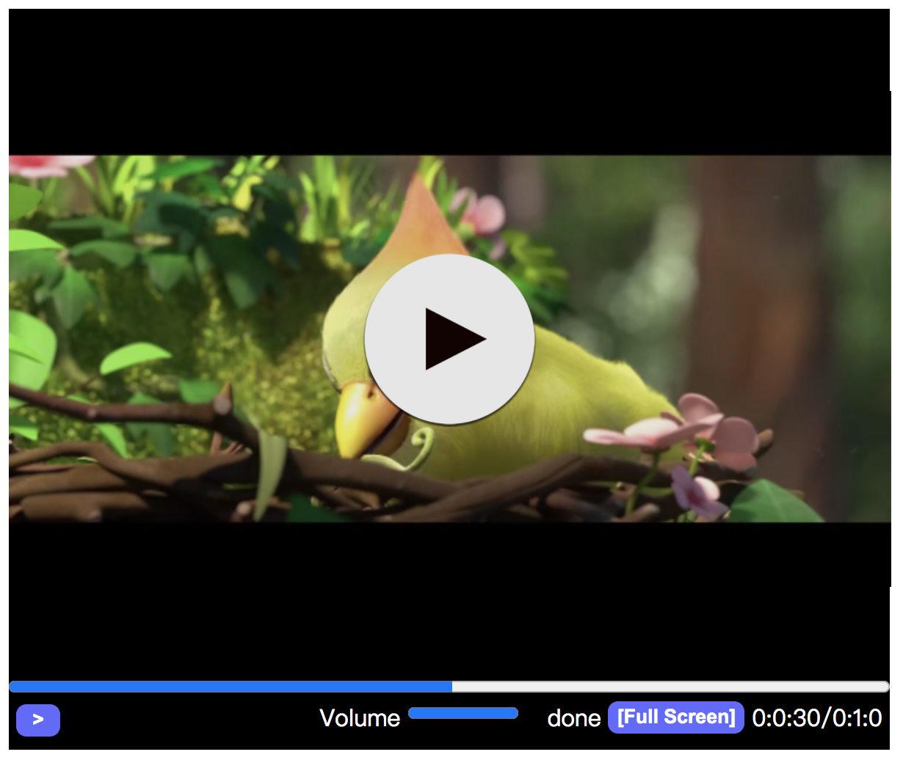
</p>

<p align="center">
  <a href="https://h265web.com/"></a>
  <a href="https://h265web.com/player.php"></a>
  <a href="https://github.com/numberwolf/h265web.js"></a>
  <a href="https://h265web.com/markdown-docs/zh/get-started.php"></a>
  <a href="./DOCS/README-HowToUse-CN.MD"></a>
</p>

> **自 2017 年持续打磨至今，h265web.js PRO 已沉淀出成熟稳定的浏览器播放能力，兼具丰富特性与强劲性能表现。**
>
> 覆盖 HEVC/H.265、AVC/H.264、AV1、WebRTC，以及直播、点播、WebCodec、WASM、MediaInfo、截图、全屏、Seek、多实例等核心能力。
>
> **推荐流媒体服务：** [ZLMediaKit](https://github.com/ZLMediaKit/ZLMediaKit)，适合和 h265web.js 搭配做直播与点播分发。

一个支持 HEVC/H.265、AVC/H.264、AV1、多协议直播点播、WebCodec / WASM / 多线程等能力的浏览器播放器 SDK。  
适合做网页播放器、视频监控、直播观看、点播播放、协议兼容验证和播放器二次封装。 

## 快速入口

- GitHub: https://github.com/numberwolf/h265web.js
- 文档（官网 How to use）: https://h265web.com/markdown-docs/zh/get-started.php
- 文档（本地 How to use）: [README-HowToUse-CN.MD](./DOCS/README-HowToUse-CN.MD)
- QA WIKI（常见问题）: [中文](https://h265web.com/markdown-docs/zh/qa-wiki.php) · [English](https://h265web.com/markdown-docs/qa-wiki.php)
- 官网: https://h265web.com/
- 官网 Demo: https://h265web.com/player.php

## 联系方式

- GitHub: https://github.com/numberwolf/h265web.js
- Email: porschegt23@foxmail.com
- QQ 群: 925466059（推荐）
- QQ: 531365872
- Discord: numberwolf#8694
- Wechat: numberwolf11

## 演示入口

- 官网 Demo: https://h265web.com/player.php
- WebRTC WHIP 推流演示: [webrtc-publish.html](./webrtc-publish.html)
- WebRTC WHEP 拉流演示: [webrtc-play.html](./webrtc-play.html)
- 文档（官网 How to use）: https://h265web.com/markdown-docs/zh/get-started.php
- 文档（本地 How to use）: [README-HowToUse-CN.MD](./DOCS/README-HowToUse-CN.MD)


### 适合什么场景

- 浏览器播放 HEVC / H.265、AVC / H.264、AV1
- 点播与直播统一接入
- MP4 / MOV / MKV / FLV / MPEG-TS / M3U8 / HLS / HTTP-FLV / WS-FLV / HTTP-TS / WS-TS / WebRTC / HEVC ES 等协议验证
- 需要截图、MediaInfo、倍速、Seek、全屏、多实例、多线程等能力的网页播放器项目

### 接入案例（部分）

<font color="blue">
<strong>

|  |  |  |  |  |  |  |  |
| ---- | ---- | ---- | ---- | ---- | ---- | ---- | ---- |
| 拼多多 | 快手 | 爱奇艺 | 百度集团 | 百度智能云 | 北京数通魔方 | 杭州诚智天扬 | 南京一乙 |
| <br> | <br> | <br> | <br> | <br> | <br> | <br> | <br> |
|  |  |  | <br> | <br> | <br> | <br> | <br> |
| 山东呢尔德 | 上海联通 | 西安思华 | <br> | <br> | <br> | <br> | <br> |

</strong>
</font>

<h3>能力矩阵</h3>

<strong>
<font color="black">

| <font color="gray">Feature</font> | <font color="gray">Feature</font> | <font color="gray">Feature</font> | <font color="gray">Feature</font> |
| ---- | ---- | ---- | ---- |
|  |  |  |  | 
| HLS(LIVE)| M3u8(VOD) | MP4(VOD) | FLV(VOD) | 
| <br> | <br> | <br> | <br> |
|  | 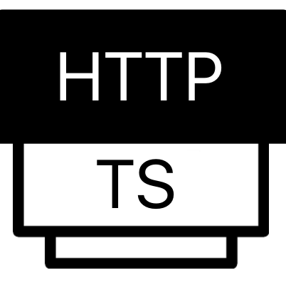 |  | 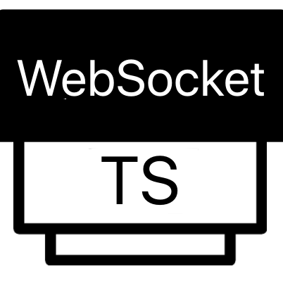 |
| HTTP-FLV(LIVE) | HTTP-TS(LIVE) | WS-FLV(LIVE) | WS-TS(LIVE) |
| <br> | <br> | <br> | <br> |
| 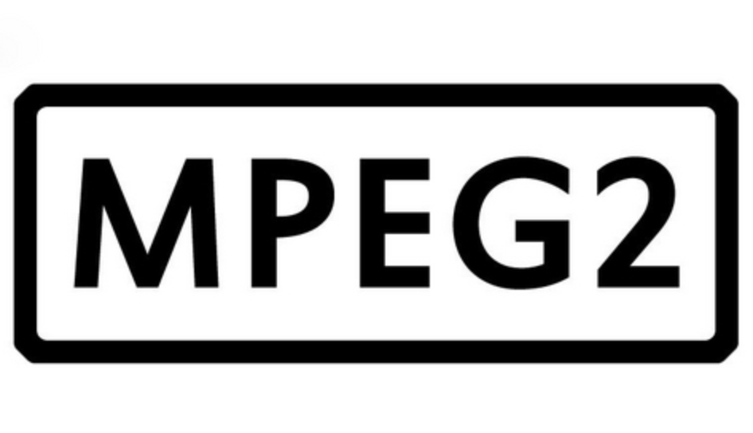 |  |  | |
| MPEG-TS(VOD) | MPEG-PS(VOD) | AV1(Chrome) | MOV(H.265) |
| <br> | <br> | <br> | <br> |
| 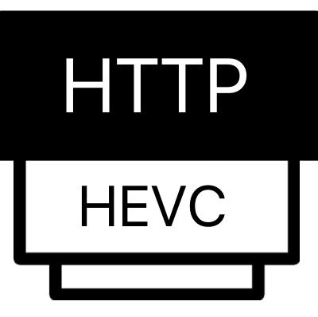 | 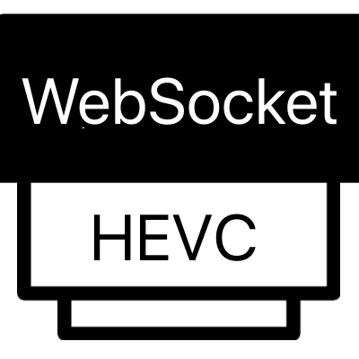 | <br> |  |
| HTTP-HEVC | WS-HEVC | MKV(HEVC) | AAC(MAIN/LC) |
| <br> | <br> | <br> | <br> |
|  |  |  |  | 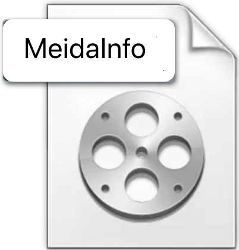  |
| Multi-Thread<br><font color="red">(only:<br>https+nginx conf)</font> | Single-Thread | G711A(HTTP-FLV) | G711U(HTTP-FLV) |
| <br> | <br> | <br> | <br> |
|  | 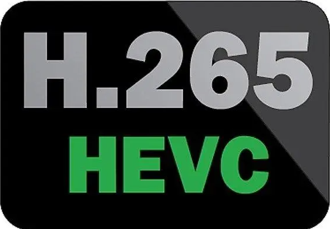 | 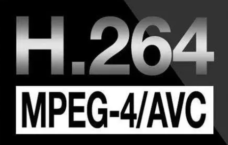 | 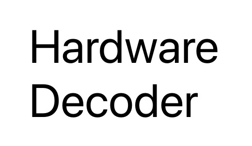 |
| MediaInfo | HEVC/H.265 | AVC/H.264 | Hardware decoder<br>硬解码<br>(FLV/HTTP-FLV/MP4) |
| <br> | <br> | <br> | <br> |
|  | <br> | <br> | <br> |
| WebRTC（直播） | <br> | <br> | <br> |

</font>
</strong>

<hr>

#### 能力支持 ####

* 协议

| 协议  | 模式 | 是否支持 | 说明 |
| ---- | ---- |  ----  | ---- |
| mp4 | 点播 |  是  | ---- |
| mov | 点播 |  是  | HEVC/H.265 |
| mkv | 点播 |  是  | HEVC/H.265 |
| av1 | 点播 |  是  | Chrome |
| mpeg-ts | 点播 |  是  | ---- |
| mpeg-ps | 点播 |  是  | ---- |
| m3u8 | 点播 |  是  | ---- |
| hls | 直播 |  是  | ---- |
| flv | 点播 |  是  | --- |
| http-flv | 直播 |  是  | CodecID=12 |
| http-ts | 直播 |  是  | ---- |
| http-hevc | 直播 |  是  | ---- |
| http-hevc | 点播 |  是  | ---- |
| websocket-hevc | 直播 |  是  | ---- |
| websocket-flv | 直播 |  是  | ---- |
| websocket-ts | 直播 |  是  | ---- |
| WebRTC / WHEP | 直播 | 是 | 标准 HTTP 信令入口，推荐用于拉流播放 |
| webrtc:// | 直播 | 是 | SDK 兼容地址，内部转换为 WHEP 信令 |
| ZLM WebRTC API | 直播 | 是 | ZLMediaKit 私有信令接口 |
| HEVC/H.265 | 点播 |  是  | ---- |
| HEVC/H.265 | 直播 |  是  | ---- |
| AVC/H.264 | 点播 |  是  | ---- |
| AVC/H.264 | 直播 |  是  | ---- |

* 编码

| 编码 | 是否支持 | 说明 |
| ---- |  ----  | ---- |
| AVC/H.264 |  是  | ---- |
| HEVC/H.265 |  是  | ---- |
| AAC |  是  | ---- |
| G711A |  是  | HTTP-FLV |
| G711U |  是  | HTTP-FLV |
| AV1 |  是  | Chrome |

* 能力

| 能力 | 是否支持 | 其他 |
| ---- | ---- |  ----  |
| 硬解码 | 是 |  适配Chrome/Safari等 |
| WebCodec | 是 | 浏览器硬解码优先路径 |
| SIMD | 是 | WASM + SIMD 加速路径 |
| MSE | 是 | 浏览器 MSE 播放路径 |
| 原生 WebRTC | 是 | 支持 WHEP、`webrtc://` 兼容地址和 ZLM 私有信令 |
| WebRTC 自动选链 | 是 | SDK 内识别 URL，也可通过 `core: 'webrtc'` 强制选择 |
| WebRTC 单轨播放 | 是 | 支持音视频、仅视频和仅音频协商结果 |
| VR360 视频播放（ERP 片源） | 本地 Job5 构建 | 拖动观看 360° 点播和直播；需使用包含 VR API 的 SDK 构建 |
| 直播 | 是 |  ----  |
| 点播 | 是 |  ----  |
| Seek跳转 | 是 | ---- |
| 精准Seek | 是 |  ----  |
| 封面图 | 是 |  ----  |
| 边下边播 | 是 |  ----  |
| 音量调节 | 是 |  ----  |
| 播放 | 是 |  ----  |
| 暂停 | 是 |  ----  |
| 重新播放 | 是 |  ----  |
| 暂停截图 | 是 |  ----  |
| 1080p播放 | 是 |  ----  |
| 720p播放 | 是 |  ----  |
| 多路播放 | 是 |  ----  |
| 去音频播放 | 是 |  ----  |
| 缓冲进度 | 是 |  ----  |
| 开启全屏播放 | 是 |  ----  |
| 退出全屏播放 | 是 |  ----  |
| 逐帧播放 | 是 |  ----  |
| 截图 | 是 | ----  |
| 自动播放 | 是 | HTTP-FLV 265+264<br>HTTP-TS 265+264<br>HLS 264  |
| 设置缓存长度 | 是 | MP4 265 |
| 多线程解码 | 是 | (需要HTTPS+配置NGINX支持) |
| 单线程解码 | 是 | 兼容性强 |
| 获取 MediaInfo | 是 | ---- |
| 获取 Codec编码 | 是 | 视频&音频 |
| 获取 Media Duration 时长 | 是 | 视频&音频|
| 获取 视频尺寸 | 是 | ---- |
| 获取 视频帧率 | 是 | ---- |
| 获取 音频采样率 | 是 | ---- |
| 追帧策略算法 | 是 |  HTTP-FLV(no audio) |
| 倍速调整 | 是 |  H.264/H.265/AV1 |
| Resize缩放 | 是 | ---- |
| 获取SEI | 是 | ---- |

<br>

## WebRTC 推流与拉流

WHIP 是标准 WebRTC HTTP 推流协议，WHEP 是标准 WebRTC HTTP 拉流协议。h265web.js 是播放器，因此推荐使用 WHEP 播放地址。HTTP(S) 地址负责 SDP 信令，协商后的媒体仍通过 WebRTC ICE/DTLS/SRTP 传输。

- 浏览器 WHIP 推流演示：[webrtc-publish.html](./webrtc-publish.html)
- h265web.js WHEP 拉流演示：[webrtc-play.html](./webrtc-play.html)

ZLMediaKit 将 RTMP 转为 WebRTC 前，需要设置：

```ini
[protocol]
modify_stamp=1
paced_sender_ms=0
```

`modify_stamp=1` 使用 ZLMediaKit 接收数据时的系统时钟并做平滑处理。部分 H.264 + AAC RTMP 输入在 `modify_stamp=2` 下虽然仍以正常帧率解码，但 Chrome 原生 WebRTC 播放阶段会把时间轴异常的帧判定为过期帧并丢弃。

下面是已经真实验证的 H.264 + AAC 推流命令。FFmpeg 将流推给 ZLMediaKit，再由 ZLMediaKit 提供 WHEP 拉流：

```bash
ffmpeg -hide_banner -stream_loop -1 -re \
  -i /path/to/input.flv \
  -vf scale=640:360,format=yuv420p \
  -c:v libx264 -preset veryfast -tune zerolatency \
  -profile:v baseline -level 3.1 -bf 0 \
  -g 25 -keyint_min 25 -sc_threshold 0 \
  -c:a aac -profile:a aac_low -ar 44100 -ac 2 -b:a 128k \
  -f flv rtmp://127.0.0.1/live/test
```

播放器支持以下三种输入地址：

```text
http://127.0.0.1/index/api/whep?app=live&stream=test
webrtc://127.0.0.1/live/test
http://127.0.0.1/index/api/webrtc?app=live&stream=test&type=play
```

第一种是标准 WHEP 地址，推荐使用。`webrtc://` 是 SDK 兼容地址，内部转换为 WHEP。第三种是 ZLMediaKit 私有信令接口。

```js
const player = H265webjsPlayer();

player.on_ready_show_done_callback = function () {
  console.log('WebRTC 首帧就绪');
};

player.on_play_time = function (seconds) {
  console.log('WebRTC 播放时间', seconds);
};

player.on_error_callback = function (error) {
  console.error('WebRTC 播放错误', error);
};

player.build({
  player_id: 'canvas111',
  base_url: './static/',
  wasm_js_uri: 'h265web_wasm.js',
  wasm_wasm_uri: 'h265web_wasm.wasm',
  ext_src_js_uri: 'extjs.js',
  ext_wasm_js_uri: 'extwasm.js',
  width: 640,
  height: 360,
  auto_play: false,
  ignore_audio: false,
  core: 'webrtc'
});

player.load_media('http://127.0.0.1/index/api/whep?app=live&stream=test');
```

不设置 `core` 时，SDK 会自动识别三种 WebRTC 地址。WebRTC 继续使用播放器原有生命周期和 callback 名称，不需要第二套公开 API。原生 WebRTC 直播固定 1x，不支持 Seek。标准 WebRTC 只能接收浏览器成功协商的编码；未协商编码的 WebCodecs/WASM 降级需要服务器实现可选的 `h265web-rtc-encoded/v1` 编码媒体传输协议。

## 本地 Job5 构建的 VR360 视频播放

使用真正的单目 360° 视频（通常是 2:1 的等距柱状/ERP 片源）；打开 VR 开关不会把普通视频变成全景。设置 `projection: 'erp360'` 可观看 VR360，`flat` 则是普通平面播放。本地 Job5 构建不改原有解码和时钟；视角控制 API 包括 `set_projection()`、`set_vr_view()`、`rotate_vr_view()`、`reset_vr_view()` 和 `set_vr_controls()`。固定公开 CDN 版本不保证包含 Job5，请先检查 SDK。片源、CORS 和首帧排查见 [API 文档](https://h265web.com/markdown-docs/zh/api-docs.php)与 [QA WIKI（常见问题）](https://h265web.com/markdown-docs/zh/qa-wiki.php)。


# 文档入口

- 中文 Docs 首页: https://h265web.com/markdown-docs/zh/get-started.php
- 入门指南: https://h265web.com/markdown-docs/zh/get-started.php
- 简单演示: https://h265web.com/markdown-docs/zh/simple-demo.php
- API 文档: https://h265web.com/markdown-docs/zh/api-docs.php
- QA WIKI（常见问题）: https://h265web.com/markdown-docs/zh/qa-wiki.php
- Donate: https://h265web.com/markdown-docs/zh/donate.php

### 合作项目

* [好用的流媒体服务 ZLMediaKit](https://github.com/ZLMediaKit/ZLMediaKit)

* [FFmpeg支持265的HTTP-FLV直播](https://github.com/numberwolf/FFmpeg-QuQi-H265-FLV-RTMP)

* [Web端265解码器](https://github.com/numberwolf/h265web.js-wasm-decoder)

* [YuvEye 国内第一款图像质量、YUV分析工具](https://www.zzsin.com/YUVEye.html)

### 关于

* [【技术社区】提问 交流 — 联系我 技术支持群](https://github.com/numberwolf/h265web.js/wiki/%E3%80%90%E6%8A%80%E6%9C%AF%E7%A4%BE%E5%8C%BA%E3%80%91%E6%8F%90%E9%97%AE-%E4%BA%A4%E6%B5%81-%E2%80%94-%E8%81%94%E7%B3%BB%E6%88%91-%E6%8A%80%E6%9C%AF%E6%94%AF%E6%8C%81%E7%BE%A4)

* [【日志】播放器更新记录](https://github.com/numberwolf/h265web.js/wiki/%E3%80%90%E6%97%A5%E5%BF%97%E3%80%91%E6%92%AD%E6%94%BE%E5%99%A8%E6%9B%B4%E6%96%B0%E8%AE%B0%E5%BD%95)

* [【作者说】为什么不建议私聊](https://github.com/numberwolf/h265web.js/wiki/%E3%80%90%E4%BD%9C%E8%80%85%E8%AF%B4%E3%80%91%E4%B8%BA%E4%BB%80%E4%B9%88%E4%B8%8D%E5%BB%BA%E8%AE%AE%E7%A7%81%E8%81%8A)

* [【作者说】关于创始人](https://github.com/numberwolf/h265web.js/wiki/%E3%80%90%E4%BD%9C%E8%80%85%E8%AF%B4%E3%80%91%E5%85%B3%E4%BA%8E%E5%88%9B%E5%A7%8B%E4%BA%BA)

<hr>

### 捐赠 ###

|  微信 | 支付宝 | PayPal |
|  ---- | ----  | ---- |
|  |  | - |

<br>

# 更新日志 #

| 更新 | 内容 |
| ---- | ---- |
| 时间 | 2026/08/25 |
| - | 0.新增原生 WebRTC 直播播放，支持标准 WHEP 信令、`webrtc://` 兼容地址和 ZLMediaKit 私有 WebRTC 接口 |
| - | 1.新增 WebRTC URL 自动选链和显式 `core: 'webrtc'`，保持原有 `build()`、`load_media()` 调用方式不变 |
| - | 2.支持音视频、仅视频和仅音频协商结果，并复用已有生命周期、错误 callback、Release/Rebuild 和多实例隔离 |
| - | 3.新增 WHIP 推流与 WHEP 拉流演示，并完成 WHEP、MP4、HTTP-FLV、HTTP-TS 的真实 Chrome 回归 |
| - | 4.补充 ZLMediaKit `modify_stamp=1` 前置要求，避免 RTMP 转 WebRTC 时音视频时间轴导致浏览器呈现丢帧 |
| 时间 | 2026/08/10 |
| - | 0.新增回调感知的 HLS 主线路由，覆盖 Native HLS、MSE、WebCodec 和 WASM；`auto`/`mainline` 不会进入 `past-core/ext*`，只有显式设置 `legacy` 才使用历史内核 |
| - | 1.对齐 HLS、MP4、FLV、MPEG-TS 的回调契约，覆盖 SEI、NAL/帧/渲染、缓存、Seek、生命周期、GPU 和 A/V 同步回调 |
| - | 2.完善 HLS 主/媒体播放列表、重定向、直播滑动窗口、Discontinuity、编码探测、HEVC Sample、关键帧和时间戳处理 |
| - | 3.增强 Seek 完成语义、Release/Rebuild、Worker 清理、有界释放超时和多实例隔离 |
| - | 4.明确音频控制语义：`ignore_audio` 表示跳过音频链路而不是静音；`set_voice(0)` 后可通过设置正音量恢复声音 |
| - | 5.更新中英文接入文档，并扩充自动化测试与浏览器回归覆盖 |
| 时间 | 2026/08/03 |
| - | 0.优化 Auto 选核顺序：原生/MSE > WebCodec > WASM/SIMD，并提供受控回退 |
| - | 1.完善 H.264/H.265 搭配 AAC、PCM、G.711A、G.711U 的播放兼容；音频不支持时不再降低可播放的视频核心 |
| - | 2.修复 HEVC B 帧 HTTP-TS、WebSocket-TS 直播反复小范围回退和跳帧：只对检测到异常 DTS 节奏的直播 TS 重建 DTS，并保留 CTS 重排信息 |
| - | 3.改进播放器生命周期清理、错误回退和多实例稳定性 |
| 时间 | 2026/03/28 |
| - | 0.更新更强大的版本 |
| 时间 | 2022/11/06 |
| - | 0.更新 |
| 时间 | 2022/11/02 |
| - | 0.更新 WASM |
| 时间 | 2022/10/22 |
| - | 0.支持 FLV/HTTP-FLV/MP4 硬解码 |
| - | 1.支持 MPEG-TS 中的 AVC |
| 时间 | 2022/09/13 |
| - | 0.修复 AVC 流关闭自动播放时的循环缓冲错误 |
| 时间 | 2022/09/12 |
| - | 0.修复不含 `http` 文本的 HEVC 地址无法播放 |
| 时间 | 2022/08/24 |
| - | 0.支持 Safari 原生播放器（版本 > 13） |
| 时间 | 2022/08/23 |
| - | 0.修复 AVC 缓冲进度 |
| 时间 | 2022/08/13 |
| - | 0.支持 Resize |
| 时间 | 2022/07/27 |
| - | 0.支持播放倍速调整 |
| 时间 | 2022/07/12 |
| - | 0.修复若干问题 |
| 时间 | 2022/07/06-10 |
| - | 0.支持 G.711U（HTTP-FLV） |
| - | 1.修复无音频 HTTP-FLV（AVC）播放 |
| 时间 | 2022/07/01 |
| - | 0.优化无音频 HTTP-FLV 直播性能 |
| 时间 | 2022/06/27 |
| - | 0.修复 HLS 解析问题 |
| 时间 | 2022/06/26 |
| - | 0.支持 G.711A（HTTP-FLV） |
| - | 1.修复 AVC FLV 的 MediaInfo 错误 |
| - | 2.支持多线程/单线程 |
| 时间 | 2022/05/18 |
| - | 0.支持多线程解码 |
| - | 1.支持 MP4 缓存长度配置 |
| - | 2.性能优化 |
| - | 3.该版本为 Beta 版本 |
| 时间 | 2022/05/09 |
| - | 0.支持 WebSocket 265 裸流播放 |
| 时间 | 2022/05/07 |
| - | 0.修复 MP4 点播重试错误 |
| - | 1.支持通过 URL 创建 HEVC 裸流点播 |
| - | 2.支持 MKV 格式 |
| 时间 | 2022/04/21 |
| - | 0.性能优化 |
| 时间 | 2022/04/17 |
| - | 发布新的开源免费协议 <a href="LICENSE-Free_CN.MD">CYL_Free-1.0 LICENSE-Free_CN.MD</a> |
| 时间 | 2022/04/14 |
| - | 0.支持 MOV 文件 |
| - | 1.支持 HTTP-FLV/HTTP-TS/HLS 自动播放 |
| - | 2.优化 1080P MP4 点播性能 |
| - | 3.增加 MP4 探测重试 |
| - | 4.支持 AV1 |
| - | 5.支持逐帧播放 |
| - | 6.支持视频帧截图 |
| 时间 | 2022/03/28 |
| - | 0.支持 MPEG-PS（MPEG1）流 |
| 时间 | 2022/03/02 |
| - | 0.修复 H.264 FLV 直播重试后无法获取分辨率 |
| 时间 | 2022/01/17 |
| - | 0.修复 HLS 265 OOM 问题 https://github.com/numberwolf/h265web.js/issues/108 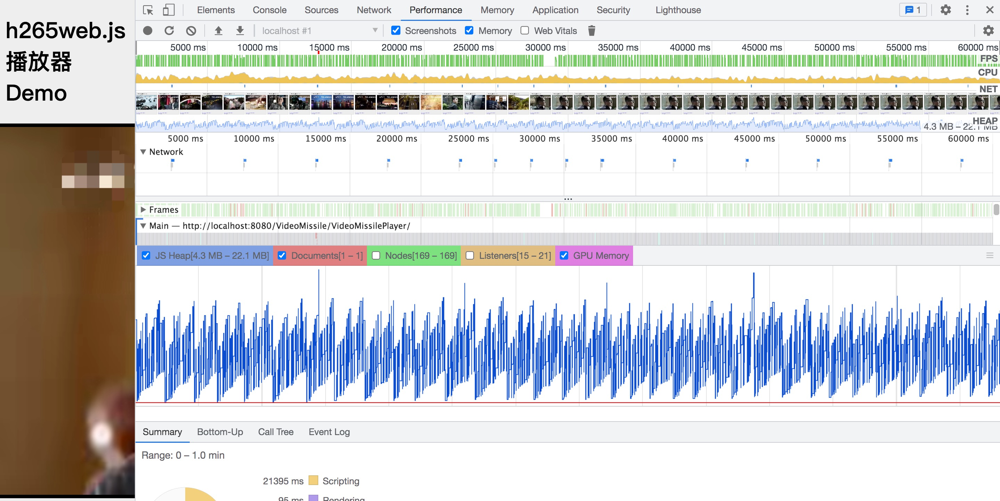 |
| - | 1.修复 HLS 分片规则问题 https://github.com/numberwolf/h265web.js/issues/105 |
| - | 2.新增演示 <a href="index-debug.html">index-debug.html</a> |
| - | 3.修复同时播放 10 路以上 H.264 时栈溢出导致播放失败 |
| 时间 | 2021/12/31 |
| - | 0.增加 H.264 HTTP-FLV 错误重试 |
| 时间 | 2021/12/24 |
| - | 0.修复部分 H.264 HTTP-FLV 回调异常情况 |
| 时间 | 2021/12/19 |
| - | 0.修复 H.264 HLS 回调问题 |
| 时间 | 2021/12/08 |
| - | 0.修复 H.264 MP4 的 onReadyShowDone 事件问题 |
| 时间 | 2021/12/04 凌晨 |
| - | 0.修复 HTTP-FLV 265 渲染崩溃 |
| - | 1.修复 HLS 全屏问题 |
| - | 2.修复若干问题 |
| 时间 | 2021/11/29 晚上 |
| - | 0.修复 HTTP-FLV 重试场景及若干问题 |
| 时间 | 2021/11/25 晚上 |
| - | 0.修复 HTTP-FLV/WS 直播 ignoreAudio 问题 |
| 时间 | 2021/11/23 晚上 |
| - | 0.修复 https://github.com/numberwolf/h265web.js/issues/90 |
| 时间 | 2021/11/21 凌晨 |
| - | 0.支持 WebSocket-FLV（HEVC/H.265） |
| - | 1.支持 WebSocket-TS（HEVC/H.265） |
| - | 2.支持 HTTP-TS（HEVC/H.265） |
| 时间 | 2021/11/16 晚上 |
| - | 0.首次请求无响应并超时后重试 5 次 |
| 时间 | 2021/11/15 晚上 |
| - | 0.HTTP-FLV 无数据包超时后自动重试（7 秒） |
| 时间 | 2021/11/14 晚上 |
| - | 0.增加可自动扩容的 265 MB WASM 文件版本 |
| - | 1.增加可自动扩容的 512 MB WASM 文件版本 |
| 时间 | 2021/11/04 晚上 |
| - | 0.修复多次 release 导致崩溃 |
| 时间 | 2021/10/26 晚上 |
| - | 0.修复若干问题 |
| 时间 | 2021/10/24 晚上 |
| - | 0.支持 AVC/H.264 的 MP4/HLS/M3U8/FLV/HTTP-FLV 播放 |
| 时间 | 2021/10/18 晚上 |
| - | 0.新增示例 |
| 时间 | 2021/10/16 晚上 |
| - | 0.修复 HTTP-FLV MediaInfo 的 codec 错误值 |
| - | 1.更新示例 |
| 时间 | 2021/10/14 晚上 |
| - | 0.修复 MediaInfo 的 codec 错误值 |
| 时间 | 2021/10/13 晚上 |
| - | 0.兼容 WebIDE 开发；拆分 WASM JS 与 h265web.js，需要单独引入 WASM JS |
| 时间 | 2021/10/12 晚上 |
| - | 0.支持无 FPS 参数的 HTTP-FLV（HEVC）直播 |
| 时间 | 2021/10/09 凌晨 |
| - | 0.支持 HTTP-FLV（HEVC）直播，CodecID=12 |
| - | 1.优化 MP4/FLV 点播跳出缓存区域时的 Seek 性能 |
| 时间 | 2021/09/27 晚上 |
| - | 0.优化 M3U8/MPEG-TS 跳出缓存区域时的 Seek 性能 |
| 时间 | 2021/09/25 凌晨 |
| - | 0.修复 HLS 直播 OOM 崩溃 |
| - | 1.修复 HLS 直播 MPEG-TS 完整路径 |
| - | 2.修复 HLS 直播短暂丢流后停止 |
| - | 3.修复 HLS 直播网络不稳定时停止 |
| 时间 | 2021/09/08 晚上 |
| - | 0.修复 M3U8 Seek 解码失败 |
| - | 1.修复部分 MP4 场景 |
| - | 2.更新配置，移除部分选项并自动设置 |
| 时间 | 2021/09/07 晚上 |
| - | 0.修复部分 M3U8 解析 MPEG-TS 文件错误 |
| 时间 | 2021/09/07 凌晨 |
| - | 0.备用播放器核心修复 MP4/FLV 点播无法 Seek 到 0，并优化播放性能 |
| 时间 | 2021/08/15 |
| - | 0.升级 H.265/HEVC 裸数据点播/直播播放器 |
| 时间 | 2021/07/18 |
| - | 0.升级播放器 UI 样式 |
| - | 1.支持进入和退出全屏 |
| - | 2.增加进入/退出全屏事件 |
| 时间 | 2021/07/11 |
| - | 0.兼容 ZLMediaKit + 华为 HoloSens 摄像机直播流 |
| 时间 | 2021/07/04 |
| - | 0.修复 <a href="https://github.com/numberwolf/h265web.js/issues/58">`ISSUE#58`</a>：默认播放器核心处于缓存帧状态时无法暂停视频 |
| 时间 | 2021/07/01 |
| - | 0.新增示例和 package.json |
| 时间 | 2021/06/27 |
| - | 0.开源 |
| - | 1.支持 FLV Seek |
| - | 2.修复备用播放器核心 Seek 问题 |
| - | 3.新增 FLV 类型，无需设置 player-core |
| 时间 | 2021/05/30 |
| - | 1.修复重要的 Seek 和播放问题 |
| - | 2.增加视频封面加载完成事件/回调 |
| 时间 | 2021/05/24 |
| - | 1.备用播放器核心支持 FLV 点播 |
| 时间 | 2021/05/21 |
| - | 1.优化无音频 HLS 直播性能 |
| 时间 | 2021/05/18 |
| - | 1.优化 HLS 直播性能并增加音频 |
| 时间 | 2021/05/16 |
| - | 1.修复 MP4 点播中 BD265 MP4 box 异常情况 |
| 时间 | 2021/05/15 |
| - | 1.修复 HLS 直播播放 |
| 时间 | 2021/04/27 |
| - | 1.修复部分视频播放时出现灰块（马赛克） |
| - | 2.修复部分视频播放首个 GOP 时出现灰块（马赛克） |
| 时间 | 2021/04/22 |
| - | 1.备用播放器核心测试模式支持 Seek |
| - | 2.备用播放器核心测试模式支持 yuvj420p |
| - | 3.其他 |
| 时间 | 2021/04/12 |
| - | 1.修复部分 HEV 编码视频播放失败 |
| - | 2.修复部分非标准 NALU 视频播放失败 |
| - | 3.修复部分视频播放出现马赛克 |
| 时间 | 2021/04/07 |
| - | 1.修复时长错误 |
| 时间 | 2021/03/28 |
| - | 1.增加缓冲进度事件 |
| - | 2.修复若干问题 |
| - | 3.移除 HLS 日志 |
| - | 4.增加无音频播放选项（新核心） |
| 时间 | 2021/03/14 |
| - | 1.修复备用播放器核心字节对齐渲染 |
| 时间 | 2021/03/12 |
| - | 1.修复 HLS 功能问题 |
| 时间 | 2021/03/06 |
| - | 1.修复备用播放器核心多流播放异常 |
| 时间 | 2021/02/28 |
| - | 1.增加输入 265 NALU 帧接口 `append265NaluFrame(nalBuf);` |
| - | 2.新增 265 裸流解析库 [raw-parser.js](./dist/raw-parser.js) |
| 时间 | 2021/02/21 |
| - | 1.新增 H.265/HEVC 解码器 SDK 项目：[h265web.js-wasm-decoder](https://github.com/numberwolf/h265web.js-wasm-decoder) |
| 时间 | 2021/02/18 |
| - | 1.备用播放器核心支持音频播放 |
| 时间 | 2021/02/08 |
| - | 1.备用播放器核心 Beta 版本：暂不支持音频和 Seek，MP4 需要将 moov box 放在 mdat 前面 |
| 时间 | 2021/01/04 |
| - | 1.播放器支持 HEVC 文件 |
| - | 2.播放器支持 HEVC 流 |
| - | 3.移除播放/暂停遮罩 |
| - | 4.新增 `onPlayFinish` 事件，在视频播放结束时触发 |

<hr>
