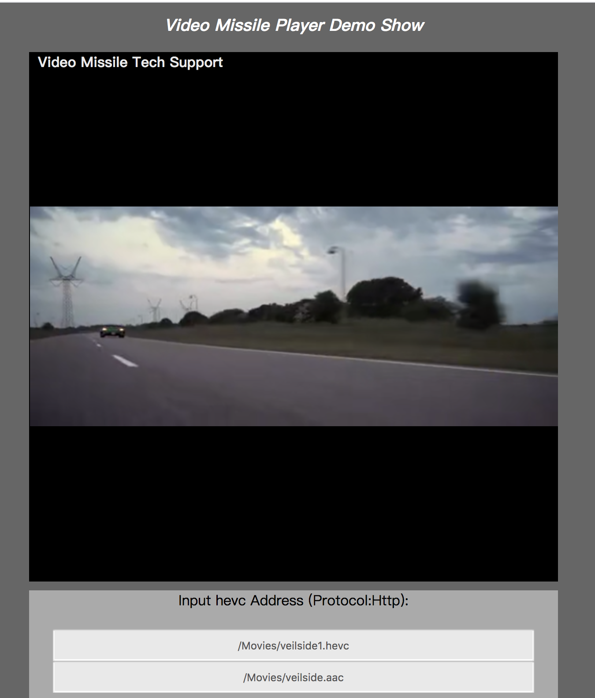

--------------------------------------------------
# h265web.js


> logo designer & copyright : porschegt23@foxmail.com (Q:531365872)

----------------------------------------

* Preview (online) http://hevc.realrace.cn/

* Capture
> 

### Core JS
`./src`

### Compile & Build

##### Compile Script

```shell
bash compile
```

##### Compile Output

`./dist`

##### Use and include

```javascript
<script src="dist/missile.js"></script>
```

### Example

* `./index265.html` Play h265 file

* `./index265aac.html` Play Hevc+AAC file

* `./index265aacWS.html` Play (Live) hevc+AAC Stream by websocket

* `./indexMp4.html` Play mp4 box file (h.265 codec)

### How to use

##### Play hevc aac files

1）Init player

```javascript
function callback() {
    // TODO
}

player = InitPlayerImp({
    width   : "600px",
    height  : "600px",
    fps     : 25,
    fixed   : false
});
player.initPlayer(callback);
```

2) Play start

```javascript
function stopPlay() {
    player.stop();
}

function continuePlay() {
    player.continueStart();
}

player.reStartPlay(play_video_url, fps);
player.reStartPlayAudio(play_audio_url);
```

##### Play hevc aac Stream (Frame)

1）初始化播放器

```javascript
player = Init(function() {
    player.createPlayer({
        width   : "600px",
        height  : "600px",
        fps     : 25,
        fixed   : false
    }, callback); // init player
});
````

2）Use websocket or others protocal to recv hevc or aac frame , and play

```javascript
var streamBytes = formatRet["streamData"];

if (tag_type == SLICE_TAG_VIDEO) {
    player.appendHevcFrame(streamBytes); // Uint8Array
} else if (tag_type == SLICE_TAG_AUDIO) {
    player.appendAACFrame(streamBytes);
}
````

3）Player Control

```javascript
player.play(); // Play
player.pause(); // Pause
player.continues(); // Continue
player.stop(); // Finish Play
```

##### Play mp4 box with h.265 Codec

1）Init Mp4 Parser

```javascript
var mp4Obj = InitMp4Parser();

var streamBuf = new Uint8Array(fileReader.result).buffer; // new FileReader().result
console.log(streamBuf);

mp4Obj.demux(streamBuf);

// Attributes for media
var durationMs  = mp4Obj.getDurationMs();
var fps         = mp4Obj.getFPS();
var sampleRate  = mp4Obj.getSampleRate();
var size        = mp4Obj.getSize();
```

2）Player setting

```javascript

player = Init(function() {
    playerStatus = player.createPlayer({
        width           : "600px",
        height          : "600px",
        appendHevcType  : APPEND_TYPE_FRAME
    }, null);
});

// Set framerate/samplerate/duration(option)
player.settingPlayer({
    fps             : fps,
    sampleRate      : sampleRate
});
// Set Duration
player.setDurationMs(durationMs);
```

3）Play with frame by frame

```javascript
var popData     = mp4Obj.popBuffer(1); // Video
var popDataAudio= mp4Obj.popBuffer(2); // Audio

if (popData != null) {
    player.appendHevcFrame(popData);
}
if (popDataAudio && popDataAudio != null) {
    player.appendAACFrame(popDataAudio);
}
```

4）Player control

```javascript
// Stop and Finished
player.stop();

// Play
player.play(function() {
    /*
     * Play callback
     */
    // play progress
    var tmp_video_pts_val = VIDEO_PTS_VAL < 0 ? 0 : VIDEO_PTS_VAL;
    console.log("tmp_video_pts_val: " + tmp_video_pts_val);

    document.getElementById("play_progress").value = tmp_video_pts_val;
    var pts_txt_hour = Math.floor(tmp_video_pts_val / 3600);
    var pts_txt_minu = Math.floor((tmp_video_pts_val % 3600) / 60);
    var pts_txt_seco = Math.floor((tmp_video_pts_val % 60));
    var pts_txt = pts_txt_hour + ":" + pts_txt_minu + ":" + pts_txt_seco;

    console.log("pts_txt:" + pts_txt);
    document.getElementById("pts_label").innerHTML = pts_txt + "/" + g_dur_txt;
});
```


### Project Dir Struct

```struct
|-- dist
|-- lib
|-- src
	|-- core
|-- videosdemo
|-- demo.html
|-- compile
|-- gulpfile.js
|-- package.json
|-- package-lock.json
|-- LICENSE
|-- README.MD
```


### Q&A
If you have any problems, you can send mail to me, or use QQ to talk with me. ~^_^~

* Email(porschegt23@foxmail.com)
* QQ: 531365872

- Wasm made by myself.

----------------------------

# License
````
https://unpkg.com/tsmon@0.4.2/LICENSE
````
Anti 996 License Version 1.0 (Draft)

Permission is hereby granted to any individual or legal entity obtaining a copy
of this licensed work (including the source code, documentation and/or related
items, hereinafter collectively referred to as the "licensed work"), free of
charge, to deal with the licensed work for any purpose, including without
limitation, the rights to use, reproduce, modify, prepare derivative works of,
publish, distribute and sublicense the licensed work, subject to the following
conditions:

1.  The individual or the legal entity must conspicuously display, without
    modification, this License on each redistributed or derivative copy of the
    Licensed Work.

2.  The individual or the legal entity must strictly comply with all applicable
    laws, regulations, rules and standards of the jurisdiction relating to
    labor and employment where the individual is physically located or where
    the individual was born or naturalized; or where the legal entity is
    registered or is operating (whichever is stricter). In case that the
    jurisdiction has no such laws, regulations, rules and standards or its
    laws, regulations, rules and standards are unenforceable, the individual
    or the legal entity are required to comply with Core International Labor
    Standards.

3.  The individual or the legal entity shall not induce or force its
    employee(s), whether full-time or part-time, or its independent
    contractor(s), in any methods, to agree in oral or written form,
    to directly or indirectly restrict, weaken or relinquish his or
    her rights or remedies under such laws, regulations, rules and
    standards relating to labor and employment as mentioned above,
    no matter whether such written or oral agreement are enforceable
    under the laws of the said jurisdiction, nor shall such individual
    or the legal entity limit, in any methods, the rights of its employee(s)
    or independent contractor(s) from reporting or complaining to the copyright
    holder or relevant authorities monitoring the compliance of the license
    about its violation(s) of the said license.

THE LICENSED WORK IS PROVIDED "AS IS", WITHOUT WARRANTY OF ANY KIND, EXPRESS OR
IMPLIED, INCLUDING BUT NOT LIMITED TO THE WARRANTIES OF MERCHANTABILITY, FITNESS
FOR A PARTICULAR PURPOSE AND NONINFRINGEMENT. IN NO EVENT SHALL THE COPYRIGHT
HOLDER BE LIABLE FOR ANY CLAIM, DAMAGES OR OTHER LIABILITY, WHETHER IN AN ACTION
OF CONTRACT, TORT OR OTHERWISE, ARISING FROM, OUT OF OR IN ANY WAY CONNECTION
WITH THE LICENSED WORK OR THE USE OR OTHER DEALINGS IN THE LICENSED WORK.

